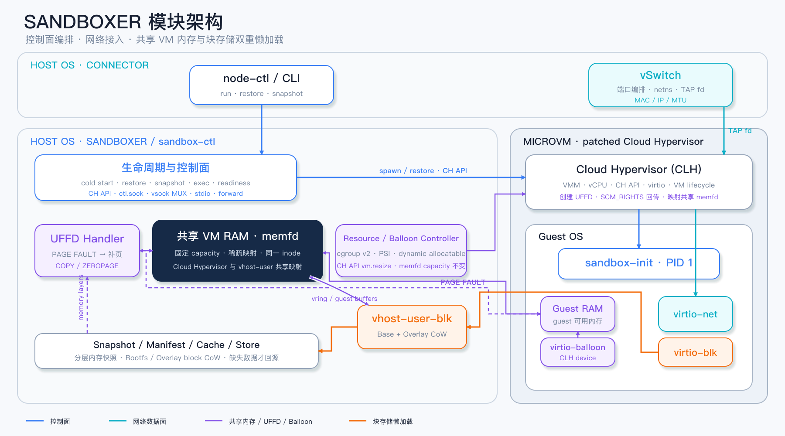
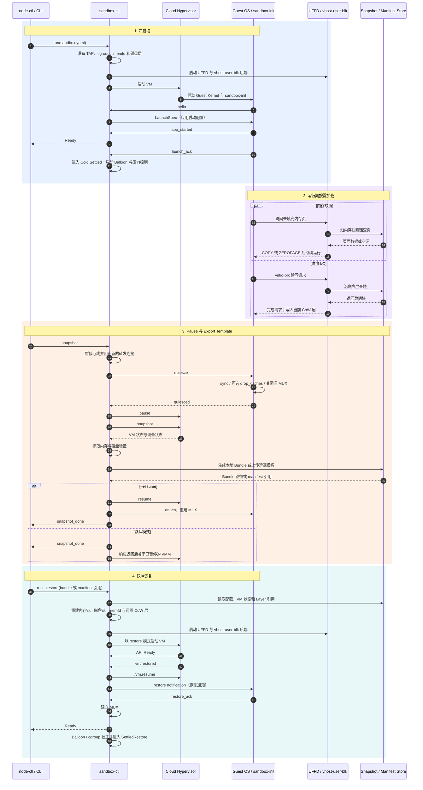
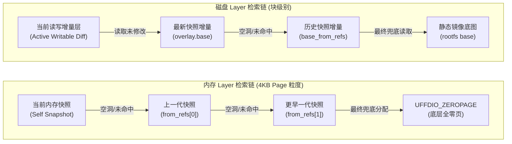
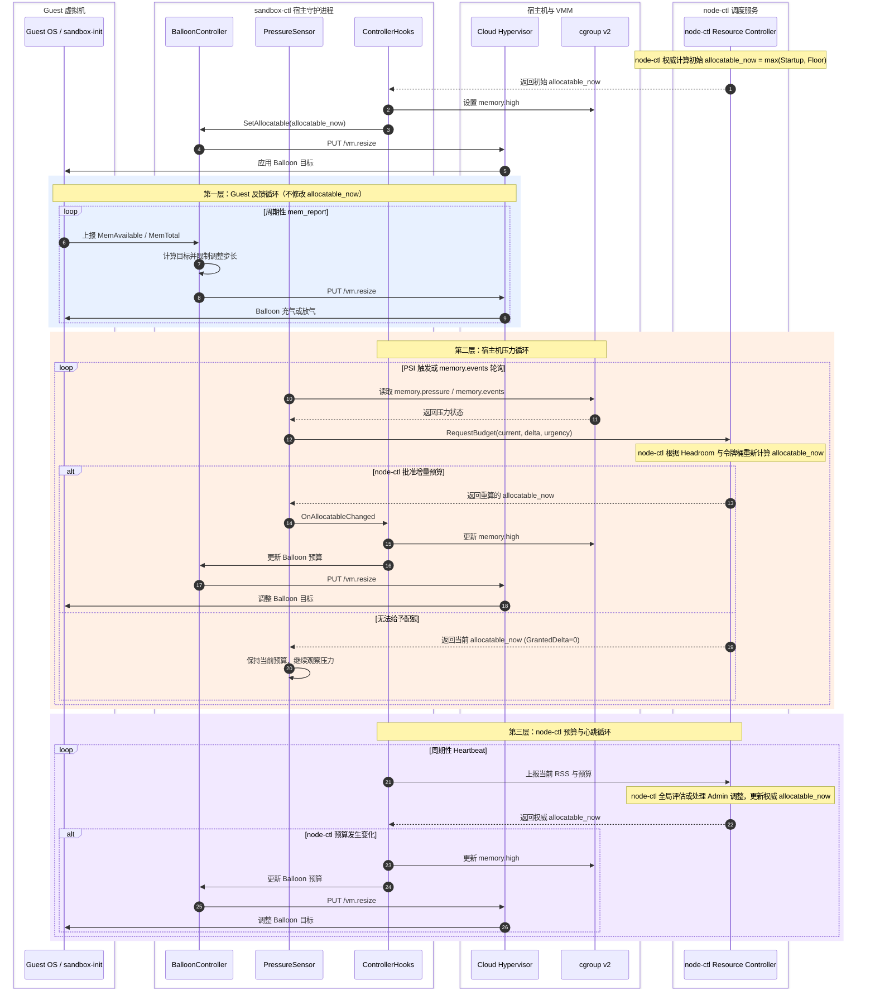
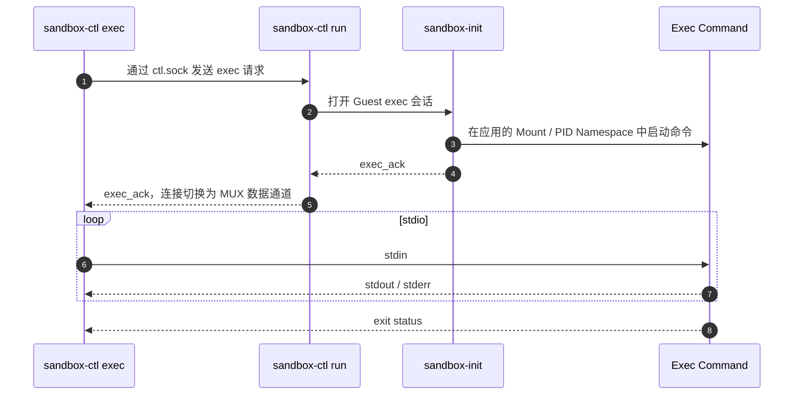
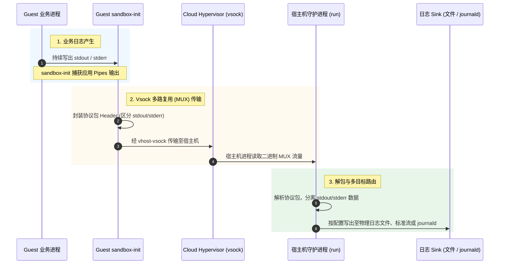

# Sandboxer 核心设计概览

## 一、Sandboxer 核心概念及其设计

### 1.1 需要解决的问题

传统虚拟机或容器运行时在启动、恢复和高密运行时，主要面临以下问题：

1. **全量 rootfs 下载**：容器 rootfs 可能很大，但一次启动通常只访问其中一部分文件和数据块。全量下载会增加启动时间和本地存储占用。
2. **全量内存快照下载**：内存快照通常远大于恢复初期真正访问的工作集。预先装载全部内存会让恢复时间随快照体积增长。
3. **Guest 内存难以由宿主机直接回收**：Guest OS 管理自己的物理页，宿主机需要借助协作机制回收空闲页，并在高密部署时协调 Guest 需求与节点可用内存。

### 1.2 设计目标

Sandboxer 围绕四个目标组织内存、磁盘和资源控制路径：

1. **懒加载**：恢复阶段不预先读取全部内存快照或 rootfs；内存页和磁盘块在首次访问时按需装载。
2. **增量快照**：每次快照只导出本轮新增或修改的数据，并通过父层引用复用历史快照。
3. **共享内存**：以 `memfd` 作为 Guest RAM 的共享后端，使 Cloud Hypervisor、UFFD 和块设备后端能够访问同一段 Guest 内存映射。
4. **高密部署**：区分 Guest 可见的内存规格与宿主机当前承诺的内存预算，通过 Balloon、cgroup 和压力反馈动态调节实际占用。

共享 `memfd` 减少了组件间重复维护 Guest RAM 的成本，但不代表整个恢复与存储链路是端到端零拷贝：数据读取、解密以及 `UFFDIO_COPY` 等阶段仍可能发生复制。

### 1.3 两个关键运行时能力

上述目标最终依赖两个可编程能力：

1. **拦截内存与磁盘访问请求**：宿主机能够在访问发生时决定从当前快照、历史层、缓存或远端存储读取数据。
2. **控制 Guest OS 内存申请**：宿主机能够打破传统虚机的隔离黑盒，根据实时的资源预算与压力信号，跨越虚机边界动态干预 Guest 的物理页申请速率，并强制回收闲置内存。

### 1.4 引入Linux内核关键能力

Sandboxer 的按需加载与高密部署，深度整合了以下四大内核与底层虚拟化能力：

| 能力模型           | 处理对象         | 核心作用                                                                                                                    |
| ------------------ | ---------------- | --------------------------------------------------------------------------------------------------------------------------- |
| **UFFD**           | Guest RAM 缺页   | 通过 `userfaultfd` 捕获未填充内存页的访问，沿内存快照链查找页面，并使用 `UFFDIO_COPY` 或 `UFFDIO_ZEROPAGE` 完成填充。       |
| **vhost-user-blk** | Guest 块设备 I/O | 在用户态处理 VirtIO 块请求；读取时沿磁盘层查找数据，写入时落到当前可写 CoW 层，从而支持 rootfs 按需读取和增量导出。         |
| **Balloon**        | Guest 可用内存   | 根据 Guest 内存状态、宿主机压力和平台预算调整 Guest 可用内存，在不改变 Guest 可见 `capacity` 的前提下回收或归还物理页。     |
| **Cgroup v2**      | 宿主机物理内存   | 提供内存压力传感（PSI）与水位线控制（`memory.high` / `memory.max`），对突发内存申请进行内核态主动节流，守住宿主机物理红线。 |

四者的分工可以概括为：UFFD 负责内存**“按需填充”**，vhost-user-blk 负责磁盘**“按需读取和写时复制”**，Balloon 负责运行期 Guest 内部**“动态回收内存”**，而 Cgroup v2 负责外部宿主机侧**“提供内存水位线硬约束与防暴冲节流”**。

---

## 二、Sandboxer 架构图



这张图可以从五条主线理解：

1. **控制面**：`sandbox-ctl` 承载 `run`、`restore`、`pause`、`snapshot`、`exec` 和健康检查，管理 Cloud Hypervisor 及其配套后端的生命周期。
2. **内存数据面**：Guest RAM 基于共享 `memfd` 建立；恢复后访问未填充页面时，由 UFFD Handler 从内存快照层中按需读取并填充。
3. **磁盘数据面**：Guest 的块设备请求进入 vhost-user-blk 后端，由 CoW 块设备按“当前可写层 → 快照层 → 历史层 → rootfs base”的顺序完成读写。
4. **资源控制面**：BalloonController 结合 Guest 内存上报、宿主机 cgroup 压力和平台预算动态调整虚拟机内存。
5. **网络数据面**：沙箱网络通过宿主机的 TAP 虚拟网卡设备接入 vSwitch 进行网络流量转发。

`sandbox-ctl` 是这些路径在宿主机侧的汇合点：它既维护生命周期状态，也负责连接 UFFD、vhost-user-blk、资源控制与 Guest 通信通道。

---

## 三、全生命周期：冷启动 → Pause → Export Template → 快照恢复

下图中的 `LaunchSpec` 是宿主机下发给 Guest 的应用启动配置；MUX 是 Guest 与宿主机之间承载控制消息和 stdio 的多路复用通道。




---

## 四、增量内存快照与磁盘增量文件

快照的核心原则是：**当前层仅保存增量变化，未变化的数据通过多级 Parent Reference 链式向下检索。**

### 4.1 核心实现机制：稀疏扫描与按需分块

为了做到极致的体积缩减与极速加载，内存与磁盘在底层实现上依托了两项关键技术：

1. **稀疏扫描（Sparse Hole 剥离）**：在打快照（Pause 状态）时，宿主机守护进程会利用内核的 `SEEK_DATA/SEEK_HOLE` 系统调用扫描共享物理内存（`memfd`）与磁盘增量文件。只有真正被分配与写入过的驻留页（Resident Pages）与脏数据块会被导出，其余空洞（Hole）直接丢弃。
2. **按需分块寻址**：导出的增量数据被切分为更小粒度的 Chunk（内存通常为 4KB 页，磁盘通常为固定或变长数据块）。当恢复执行时，系统通过 `SnapshotSource`（内存）和 `CowBlockDevice`（磁盘）根据偏移量逐层向下检索所需的 Chunk。

### 4.2 内存层与磁盘层的设计差异与 YAML 建模

在底层的 `sandbox.yaml` 与快照配置中，内存和磁盘因为其特性差异，存在不同的结构建模：

```yaml
# 【内存层】当前 Snapshot Bundle 本身即是顶层内存增量
from_refs:
  - manifest://<older-memory-snapshot-1>

boot:
  root:
    # 【磁盘层】必须拆分出静态底图 base 与 动态快照 overlay
    base: manifest://<rootfs-base-image-key>         # 静态只读底层 (如 EROFS / 容器镜像)
    overlay:
      base: manifest://<latest-snapshot-overlay>     # 最近一次快照的脏数据块
      base_from_refs:                                # 历史快照的脏数据块链
        - manifest://<older-snapshot-overlay-1>
      diff: file:///var/lib/kuasar/run/rootfs.diff   # 本次启动创建的 CoW (写时复制) 可写层
```

> [!IMPORTANT]
> **为什么内存层没有声明静态 `base`？**
> 对于磁盘而言，应用总是依赖一个包含操作系统文件的完整静态镜像（如 Ubuntu RootFS）作为 Base。但对于内存，所有的物理状态都保存在快照本身中。**内存是没有静态基底的**，在层叠链（`self -> from_refs`）中任何未命中的空洞，最终都由内核通过 `UFFDIO_ZEROPAGE` 直接映射为**全零空白页**。

### 4.3 检索路径与跨节点复用

当沙箱在远端节点拉起时，底层的 `vhost-user-blk` 和 UFFD Handler 按下述逻辑链向下穿透：



**隔离、继承与跨节点复用**：
- **写操作隔离**：虚拟机的任何磁盘写入操作，都会被宿主机 vhost 后端严格拦截并重定向，锁定在顶部的 `Writable Diff` 文件中。历史快照增量（overlay）与底图（base）在整个生命周期内**绝对只读**，确保了数据的绝对安全。
- **跨代继承避免膨胀**：如果再次对沙箱打快照（例如生成 `Snapshot 3`），系统仅会剥离 `Snapshot 2` 运行期间新产生的 `diff` 与内存脏页，将其打包为新的独立 overlay，并把旧的 `Snapshot 2` 压入 `from_refs` / `base_from_refs` 链条深处，实现了增量状态的安全叠加，且彻底规避了动辄数百 MB 历史数据的重复拷贝。
- **跨节点极速复用**：系统支持两条跨机器复用路径来实现**秒级横向扩容**：
  1. **远端对象存储分发**：快照推送后以内容寻址 Chunk 形式管控。其他节点通过 `manifest://<key>` 恢复时，底层按需通过网络拉取本地未命中的 Chunk，无需下载庞大底图。
  2. **共享文件系统直读**：若集群配置了 NAS 等共享文件系统，其他节点可直接通过 `file://<路径>` 指定共享目录下的 Snapshot Bundle，利用文件系统原生能力完成本地按需按块读取。

---

## 五、高密部署：基于 Balloon 与 Cgroup v2 的联合控制架构

高密部署的核心是在保障安全的前提下，通过内存动态调配提升单机的虚拟机纳管密度。Sandboxer 允许多个 VM 保持较大的 Guest 可见内存规格，同时在宿主机侧仅为其承诺当前实际允许使用的内存预算（`allocatable_now`）。该方案并非无边界的盲目超分，亦不保证所有沙箱均能同时占满上限。

系统设计的精髓在于将 **Guest 侧的气球设备（Balloon）**、**宿主机侧的资源隔离层（cgroup v2）** 以及 **平台级调度控制器（node-ctl）** 有效联动，在沙箱的动态需求与宿主机的实际承载力之间构建实时的闭环调节机制。

### 5.1 联合控制机制的职责拆解

两套机制分别从 Guest 内部与 Host 外部互补协作：

#### 1. Balloon：Guest 内部可用内存的弹性调节器

- **`capacity`**：Guest 操作系统可见的逻辑最大内存规格（如 1 GiB）。
- **`allocatable`**：配置文件中声明的静态稳态预算下限（如 100 MiB）。
- **`allocatable_now`**：运行时平台授权批准给该 VM 的实际物理内存配额。
- **气球目标配额算式**：
  $$\text{balloon\_target} \approx \text{capacity} - \text{allocatable\_now}$$
- **充放气控制逻辑**：当 Balloon **充气（Inflate）** 时，Guest 可用物理内存减少，强制 Guest 内核回收内部空闲物理页及缓存；当 Balloon **放气（Deflate）** 时，Guest 可用物理内存增加，释放受占内存以应对业务高峰。

*示例*：若 `capacity = 1 GiB` 且 `allocatable_now = 100 MiB`，则 `balloon_target \approx 900 MiB`。即 Guest 虽感知到 1 GiB 的虚机规格，但宿主机仅为其承诺约 100 MiB 的物理内存。

#### 2. cgroup v2：宿主机侧的软/硬资源水位边界

当使能 cgroup v2 隔离控制时，Sandboxer 会为包含 Cloud Hypervisor 在内的宿主机 cgroup 设立双重水位保护线：

- **`memory.high`（软限制水位）**：基于当前动态预算自动调优。当内存开销触及该水位时，宿主机内核会启动主动回收或对分配物理页的底层线程施加节流（Throttling）。注意：它作为前置缓冲区，旨在平抑突发分配高峰并触发回拉信号，而非绝对精密的限速器。
- **`memory.max`（硬限制红线）**：该 cgroup 允许消耗的物理上限，默认计算为 $\text{capacity} + \text{overhead}$。若内存申请跨过此红线且回收失败，将触发 cgroup 级的 OOM 处置。

*计算逻辑与生效策略*：初始 `memory.high` 默认设为 $\text{allocatable.memory} \times 0.875$；运行期随着 `allocatable_now` 的动态升降，Sandboxer 会同比例更新 `memory.high`。特别地，在 VM 从快照恢复的初始阶段（SettledRestore 之前），系统会适当延后初始 `memory.high` 的强行生效，以避免冷启动缺页热点被误杀或过度节流。

```text
Balloon 设备 (Guest 内)  ==> 主动收缩/释放 Guest 内部空闲物理页
memory.high (Host 外)  ==> 宿主机软阈值，提前预警并施加内核节流
memory.max  (Host 外)  ==> 宿主机硬阈值，守住全局物理安全红线
```

### 5.2 三层联动控制逻辑与组件分工

Sandboxer 的资源闭环由三条异步并行的控制环路协同驱动。各路径分工明确：Guest 的上报直接驱动 Balloon，而宿主的压力与平台的全局调配则由 `node-ctl` 权威更新 `allocatable_now` 后，再向下下发至 `memory.high` 与 Balloon 目标。

当前架构中，资源控制器（Resource Controller）由 `node-ctl conductor serve` 承载（通过 `resource_listen` 参数使能）。未配置该服务时，Sandboxer 默认使用静态配置预算。



#### 组件职责与实际物理进程映射

| 逻辑组件 | 所属物理进程 / 二进制实体 | 在 `allocatable_now` 控制链中的核心职责 |
| :--- | :--- | :--- |
| **`node-ctl` 资源控制器** | **`node-ctl` 守护进程** (`orchestrator/cmd/node-ctl`) | **权威计算源（Source of Truth）**：在 `Admit`、`Settled`、`RequestBudget` 与 `Admin` 操作中掌控配额算法。 |
| **`PressureSensor`** | **`sandbox-ctl` 守护进程** (`sandboxer/cmd/sandbox-ctl`) | **触发请求者**：运行于 `sandbox-ctl` 协程，监听专属 cgroup 的 PSI 压力并向平台申请追加配额。 |
| **`ControllerHooks`** | **`sandbox-ctl` 守护进程** (`sandboxer/cmd/sandbox-ctl`) | **缓存与下发同步者**：保存权威 `allocatable_now`，转译 `memory.high` 写入 cgroup，透传给 BalloonController。 |
| **`BalloonController`** | **`sandbox-ctl` 守护进程** (`sandboxer/cmd/sandbox-ctl`) | **衍生执行者**：按 $\text{balloon\_target} = \text{Capacity} - \text{allocatable\_now}$ 算得尺寸，调用 `PUT /vm.resize`。 |
| **`Cloud Hypervisor`** | **`cloud-hypervisor` 进程** | **VMM 虚拟化层**：接收 `PUT /vm.resize` 指令，负责驱动 `virtio-balloon` 设备。 |
| **`sandbox-init`** | **VM 内部 `PID 1` 进程** | **Guest 采样源**：读取内测 `/proc/meminfo`，通过 Vsock 发送 `mem_report` 给 `sandbox-ctl`。 |

### 5.3 突发高内存请求时的降级与边界防线

```text
Guest 业务突发物理内存申请
    ↓
宿主机 cgroup 物理用量随之上升
    ↓
触及 memory.high：内核施加被动回收与分配节流（Throttling）
    ↓
PressureSensor 感知到 PSI 压力与 memory.events(high) 计数自增
    ↓
调用 RequestBudget 向平台申请追加 allocatable_now 配额
    ├── 若平台批准：提升 memory.high 软线，同时 Balloon 实施放气供用
    └── 若配额拒绝 / 已达 memory.max：内核保持线程节流，若持续超发则触发 cgroup OOM
```

`memory.high` 提供了至关重要的安全缓冲与压力嗅探机制。如果 Guest 业务增长极猛、Balloon 响应存在异步时滞、或者平台整体配额池已竭尽，系统的底层 `memory.max` 将死守物理隔离边界，优先保障宿主机及其他沙箱的生存安全。

> [!TIP]
> **关于 Cgroup 继承模式 (`--cgroup-adopt`)**：
> 当指定 `--cgroup-adopt` 时，`sandbox-ctl` 与 Cloud Hypervisor 将直接放入外部现有的 cgroup 中运行。这意味着守护进程本身与虚拟机将共享同一套内存用量统计与限制。若未使能 cgroup，系统将仅依赖静态预算与 Balloon 进行控制。

---

## 六、Exec 实现与应用日志

### 6.1 Exec 链路

`sandbox-ctl exec` 不会启动新的 VM，而是在已有沙箱中创建一条独立命令会话：



Exec 命令与主应用是同一沙箱中的兄弟进程，并加入应用使用的 Mount 和 PID Namespace。`sandbox-ctl run` 在握手完成后主要负责宿主机 `ctl.sock` 与 Guest 会话之间的字节转发，最终退出状态通过同一 MUX 会话返回给 CLI。

### 6.2 应用日志

主应用的 `stdout` 和 `stderr` 也依托 Guest 与宿主机之间的 MUX 通道穿透透传：



MUX 协议包 Header 负责精准区分 stdin、stdout、stderr 和退出状态；宿主机侧守护进程解包后，根据 `--stdout-to`、`--stderr-to` 等参数将日志路由输出到目标位置。
> [!NOTE]
> Cloud Hypervisor 自身的控制台输出日志（Console Log）与 Guest 业务应用的 stdio 走的是完全两条独立的通道，互不干扰。

---

## 七、总结

| 核心问题                     | Sandboxer 机制                                                          |
| ---------------------------- | ----------------------------------------------------------------------- |
| 恢复前需要装载全部内存       | UFFD 按页处理缺页，并沿增量内存层查找数据。                             |
| 启动前需要下载全部 rootfs    | vhost-user-blk 按块读取，并通过 CoW 层隔离运行期写入。                  |
| 每次快照重复保存完整状态     | 内存 `from_refs` 与磁盘 overlay 链复用历史数据。                        |
| Guest 空闲内存难以回收       | Balloon 根据 Guest、cgroup 与平台预算动态调整可用内存。                 |
| 高密部署缺少明确资源边界     | `capacity`、`allocatable_now`、`memory.high` 与 `memory.max` 分层控制。 |
| 运行中需要执行命令和采集日志 | `ctl.sock`、Guest 会话与 MUX 连接 Exec、stdio 和退出状态。              |

Sandboxer 的整体思路是把“全量准备”改为“访问时按需加载”，把“完整复制”改为“增量分层复用”，再通过 Balloon 与 cgroup 将 Guest 内存需求纳入宿主机和平台的统一资源控制。
