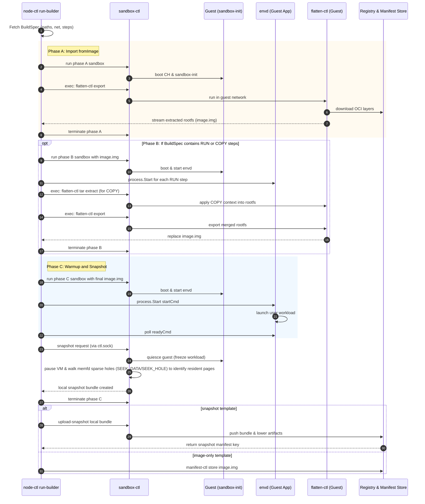
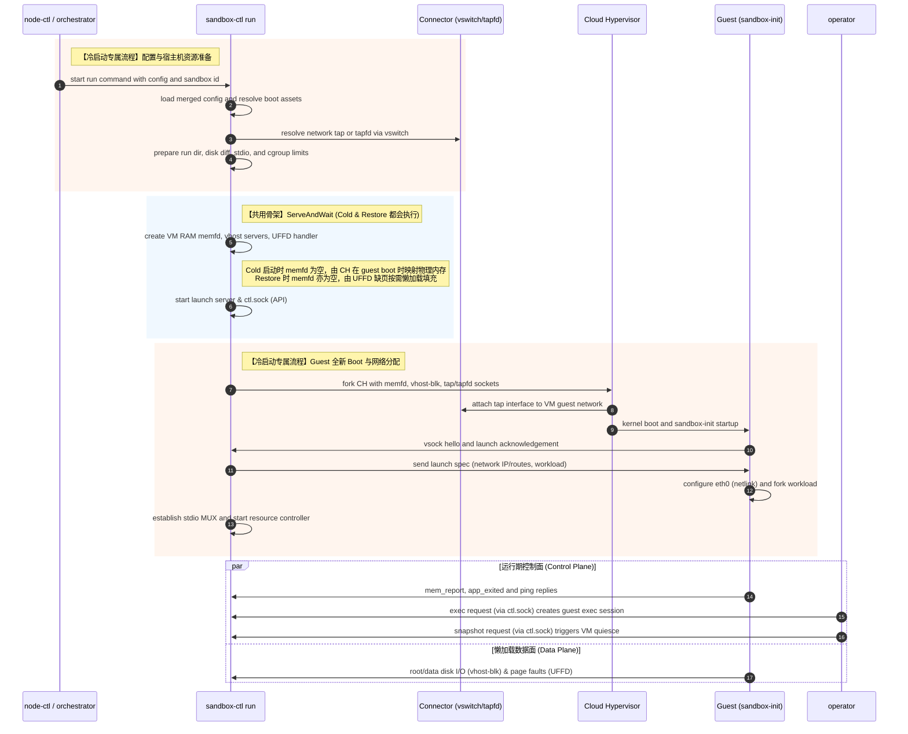
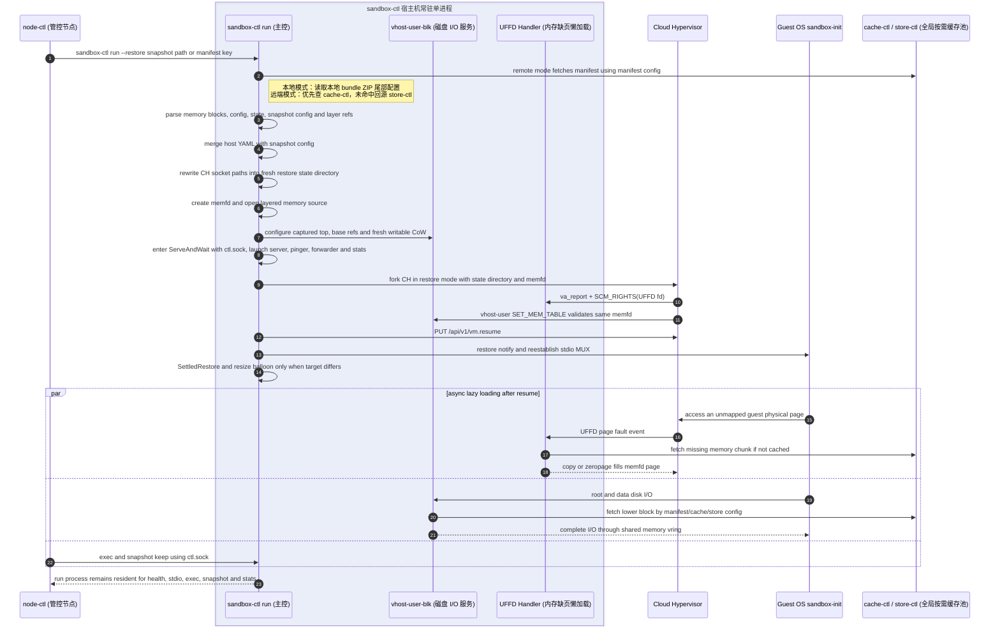
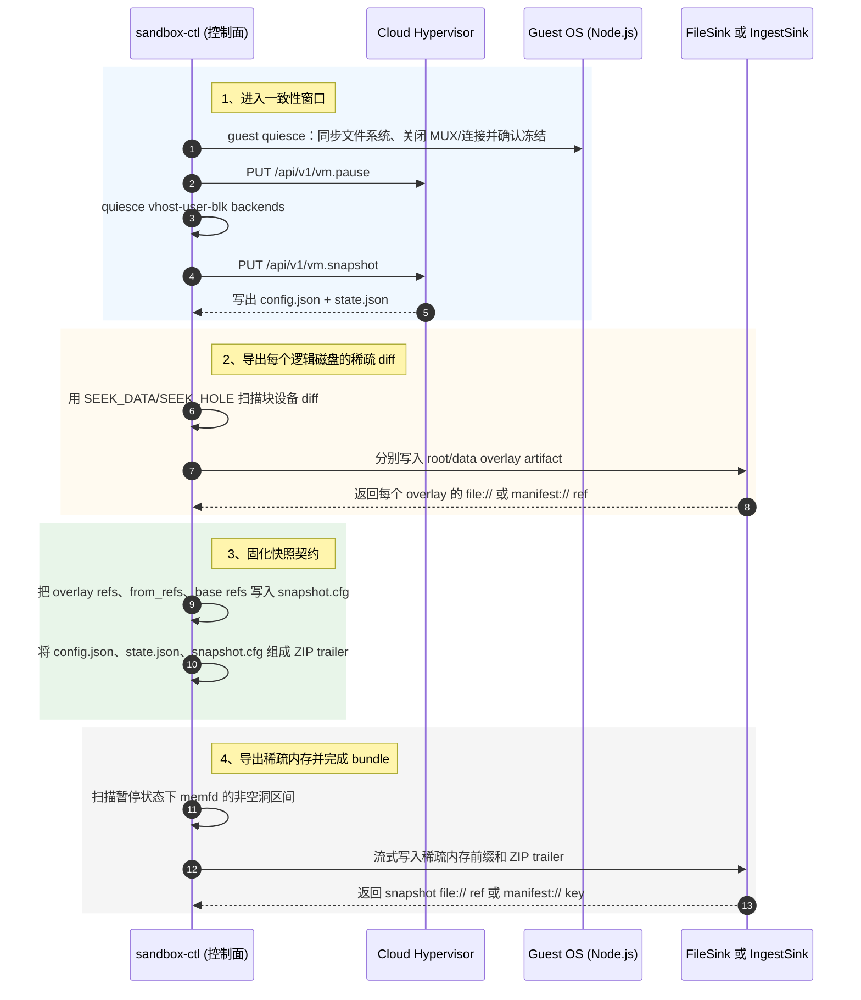
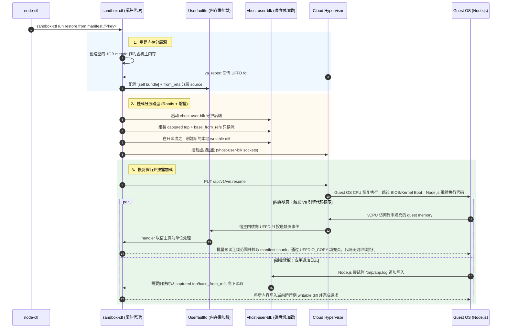
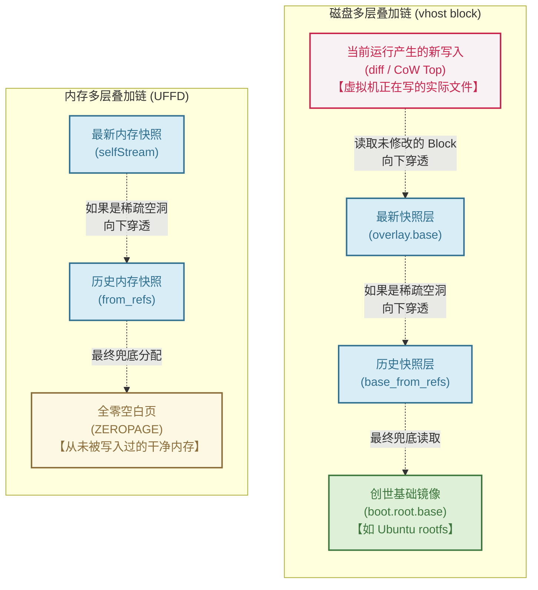
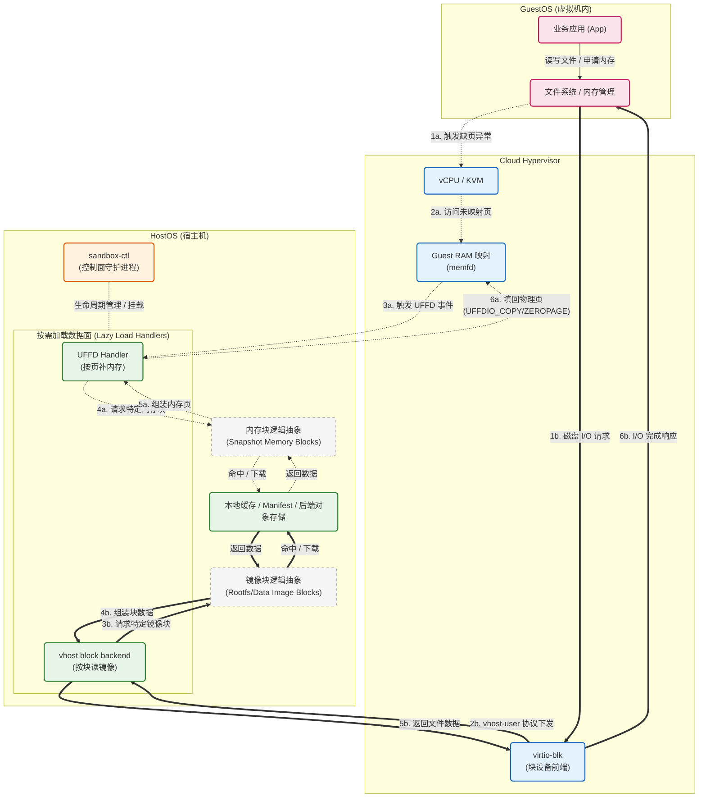
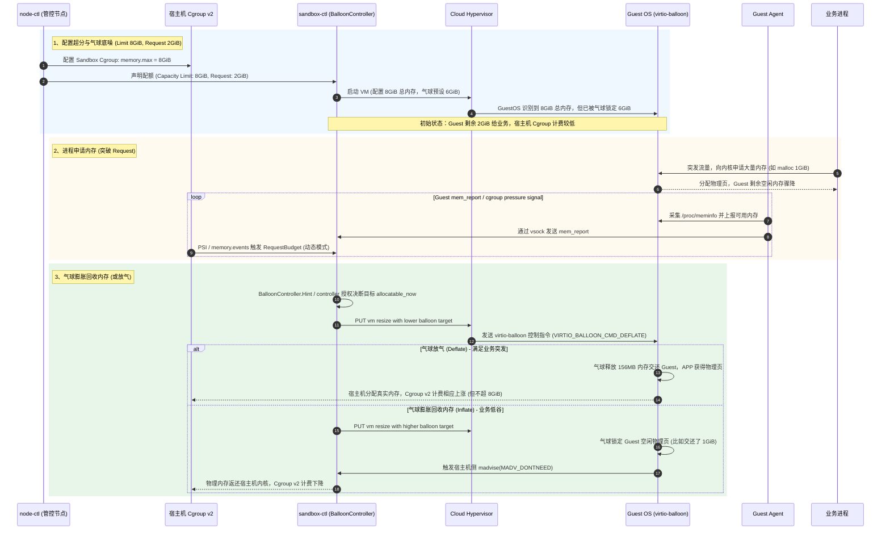
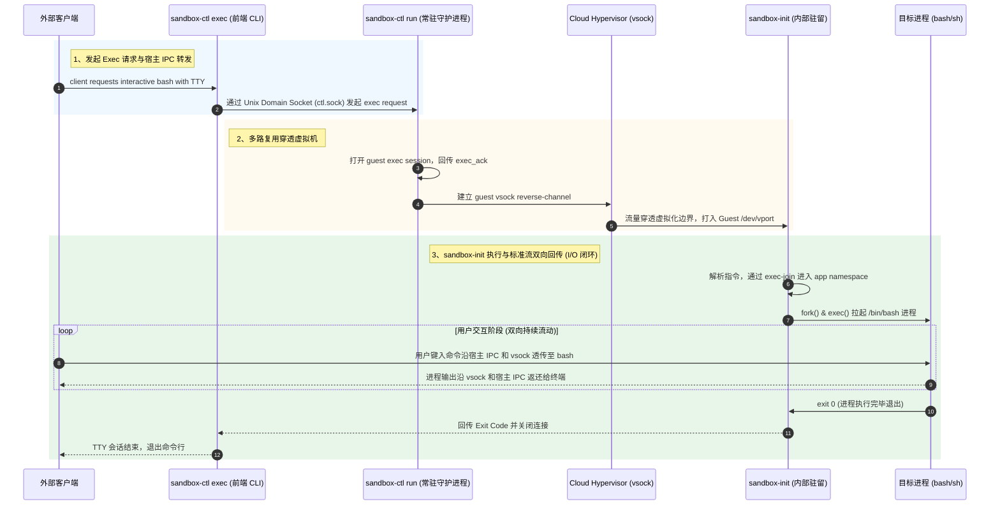
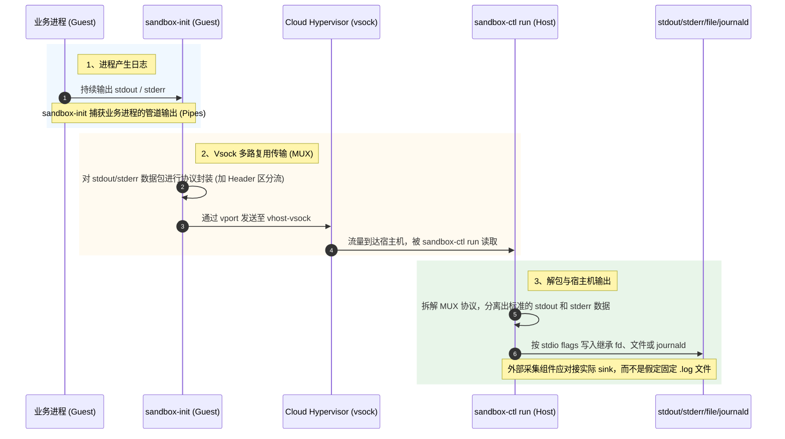

# sandboxer 核心设计

本文从读者最容易建立心智模型的顺序展开：先说明为什么需要快照沙箱，再从 `sandbox-ctl` 的配置入口和生命周期主路径建立全局视图，随后解释快照分层与 UFFD/vhost 按需加载数据面，最后补齐资源控制、exec/日志、观测排障和底层补丁。

## 1. 背景与总体架构

### 1.1 痛点与背景

在现代 Serverless 计算、函数计算（FaaS）和高并发容器场景中，沙箱的**冷启动速度**、**资源开销**以及**状态流转效率**一直是制约弹性伸缩效率的核心痛点：

1. **镜像数据沉重**：传统容器启动前通常需要完整下载并解压镜像，GB 级别镜像会显著拉长实例准备时间，使业务难以做到按需拉起。
2. **启动开销昂贵**：若采用传统虚机隔离（如传统安全容器），每次拉起完整的 GuestOS（内核初始化、驱动加载等）都需要数百毫秒乃至数秒。
3. **资源预留浪费**：为了应对突发流量和缓慢的冷启动，平台往往需要预留闲置实例池（Warm-pool），带来额外的内存占用和成本。
4. **状态保存冗余**：在多代恢复链路、跨节点复用或频繁 Pause/Resume 的场景下，传统单体快照容易反复保存相同的环境、磁盘和内存数据，放大存储与网络开销。

### 1.2 业界方案与定位

为了解决上述问题，业界演进出了多种容器底座方案。Kuasar Sandbox 聚焦于**基于 UFFD 的按需加载（Lazy Loading）**与**微虚机快照极速恢复**，目标是在强隔离、启动速度和内存占用之间取得更适合弹性场景的折中。以下是主要技术路线的对比：

| 方案维度           | 隔离级别                        | 冷启动时间（含环境准备）                 | 镜像与数据加载机制               | 内存底噪开销               | 极速快照恢复 | 典型代表                        |
| :----------------- | :------------------------------ | :--------------------------------------- | :------------------------------- | :------------------------- | :----------- | :------------------------------ |
| **原生容器**       | 弱（基于 Namespaces/Cgroups）   | 很快，但受全量镜像拉取影响明显           | 全量拉取与解压                   | 极低（共享宿主机内核）     | 否           | runc, crun                      |
| **传统安全容器**   | 强（Hardware Virt / 完整 VM）   | 慢（~500ms 以上）                        | 支持镜像按需挂载 (如 Nydus)      | 较高（需维护完整 GuestOS） | 否           | 传统 Kata Containers            |
| **用户态内核**     | 强（Syscall 拦截与沙箱模拟）    | 较快（~150ms 左右）                      | 依赖外部存储插件                 | 中等（沙箱进程本身开销）   | 否           | gVisor                          |
| **微虚机快照沙箱** | 强（Hardware Virt / 轻量级 VM） | **毫秒级恢复潜力（依赖快照和本地条件）** | **内存（缺页）与存储双重懒加载** | **较低（物理页按需分配）** | **是**       | **Kuasar Sandbox**, Firecracker |

### 1.3 sandbox-ctl 的角色

为同时兼顾硬件虚拟化隔离和快速弹性，Kuasar 引入了基于快照和双重按需加载的架构。在此架构中，`sandbox-ctl` 是 host 侧最关键的执行入口。

作为沙箱的核心守护进程，`sandbox-ctl` 既负责沙箱生命周期控制面，也承载按需加载数据面（负责补齐内存缺页和镜像块）。下文按配置入口、生命周期、快照分层、按需加载、运行期控制和观测排障展开。

### 1.4 总体模块架构


图中四种颜色分别标识控制面、网络数据面、内存懒加载和块存储懒加载。`sandbox-ctl` 位于宿主机侧的中心位置：向上承接 `node-ctl`/CLI 的生命周期请求和 vSwitch 提供的 TAP 网络，向下管理 Cloud Hypervisor；同时通过共享 memfd、UFFD handler、vhost-user-blk 和 manifest/cache/store 组成恢复后的双重按需加载数据面。

### 1.5 部署前置条件与硬件要求

Kuasar Sandbox 对底层系统和硬件有特定要求，以支撑极速启动与资源隔离：

*   **硬件要求**：
    *   **CPU**: 支持硬件虚拟化扩展 (Intel VT-x 或 AMD-V)。
    *   **内存**: 建议节点可用内存 >= 4GB，具体取决于沙箱密度。
*   **内核版本与特性**：
    *   推荐 Linux Kernel **5.15 及以上版本**（对于部分高级 UFFD 特性建议 6.x）。
    *   **Userfaultfd (UFFD)**: 必须在内核启用 (`CONFIG_USERFAULTFD=y`) 且允许非特权调用或沙箱进程具备对应权限，用于支撑内存按需加载。
    *   **Cgroup v2**: 必须挂载并启用，用于 `BalloonController` 内存回收和精准资源限制。
    *   **KVM**: `/dev/kvm` 必须可读写。
*   **依赖组件**：
    *   深度定制的 **Cloud Hypervisor** (带特有补丁，支持 vhost-user 内存底座重建)。
    *   (可选) 支持 vSwitch/网桥的网络插件，用于配置沙箱网络。

## 2. 配置模型与操作入口

`sandbox-ctl` 的行为由两类声明式配置和一组 CLI/env 参数共同决定：`sandbox.yaml` 描述 VM、网络、磁盘、guest launch 与资源控制；`manifest.yaml` 描述远端 manifest/cache/store、chunker 和加密策略；CLI/env 再补充本机路径、stdio、cgroup、统计与恢复入口。`--config` 支持 `a.yaml:b.yaml` 叠加，后一个文件覆盖前一个文件，便于把模板配置、节点配置和一次性覆盖拆开维护。本章集中说明这些入口的职责；生命周期章节不再重复解释参数。

### 2.1 沙箱运行时配置 (`sandbox.yaml`)

这是管控面在调用 `sandbox-ctl run` 时通过 `--config` 传入的核心配置文件。下面示例覆盖当前代码中最容易影响冷启动、快照和 restore 行为的字段；实际可以按场景裁剪。

```yaml
resources:
  capacity:    { cpu: 1, memory: 512MiB }
  allocatable: { cpu: 1, memory: 384MiB }
network:
  tap: sb-tap0
  interface: eth0
  ip: 169.254.1.1/31
boot:
  kernel: file:///var/lib/kuasar/vmlinux
  runtime: file:///var/lib/kuasar/sandbox-runtime.erofs
  root:
    base: manifest://<rootfs-base-key>
    overlay:
      diff: file:///var/lib/kuasar/blk1.diff
      diff_size: 1GiB
launch:
  exec: /usr/bin/python3
  args: ["-c", "print('ready', flush=True)"]
  restart: never
```

这里只展示建立生命周期心智模型所需的最小字段；资源传感器、timeouts、额外数据盘、mount/file/init 注入、plugin 和 metadata 等完整示例见附录 A。

**设计意义**：
*   **配置抽象**：把 Cloud Hypervisor 启动参数、guest runtime、root/data disks、网络交接、stdio/launch 契约与资源控制解耦，管控面只需要组合 YAML 与少量 flags。
*   **Overlay 分层存储**：`boot.root` 和 `boot.disks[]` 描述块设备分层。`base` 是只读 lower，`overlay.diff` 是运行期 writable top；快照时 writable top 会被吸收为 `<sha256>.overlay`，restore 时再与 `base_from_refs` 组合为新的 CoW 设备。
*   **资源闭环入口**：`resources.capacity/allocatable` 决定初始 VM/balloon 水位；`resources.control`、`--cgroup-path`、PSI/events sensor 和外部 controller 共同决定运行期动态 resize。
*   **当前 Schema 补充**：实际代码还支持 `network.tapfd`、`launch.plugin`、`pid_namespace`、更细的 `timeouts.*`、多 disk、mount/file/init 注入和 metadata；`launch.exec` 在无镜像默认启动配置或 single-disk 模式下是关键字段。

### 2.2 全局存储与去重配置 (`manifest.yaml`)

当 `run --restore=manifest://<key>`、`snapshot --upload` 或 `upload-snapshot` 访问远端对象时，需要 `--manifest-config` 或 `MANIFEST_CONFIG` 指向该文件。

```yaml
manifest:
  key: "<64-hex-customer-key>"
store:
  endpoint: 127.0.0.1:8080
  pool: 4
  timeout: 30s
cache:
  endpoint: ""
chunker:
  mode: cdc
  cdc: { min: 128KiB, avg: 512KiB, max: 1MiB }
crypto:
  chunk: aes
  manifest: aes
```

完整注释版配置见附录 B。

**设计意义**：
*   **全局去重**：snapshot bundle、overlay 和 lower chain 通过 chunker/manifest/store 形成内容寻址引用，跨节点复用时只拉取缺失块。
*   **密钥边界**：`manifest.key` 必须是 64 个十六进制字符（32 字节/256 位）；`MANIFEST_KEY` 可提供或覆盖 YAML 中的 key。缺乏正确 key 时无法解开 manifest/chunk。
*   **读写路径统一**：vhost 块读、UFFD page source、snapshot ingest 和 `upload-snapshot` 都复用同一套 manifest/cache/store 配置；cache 为空时直接走 store。

### 2.3 操作入口与职责边界

`sandbox-ctl` 的行为与能力主要通过多级配置参数（CLI / env / YAML）与不同的子命令向外暴露。为了避免配置混乱，本节详细梳理了各种参数的职责边界以及对应子命令的典型使用场景。

#### 2.3.1 CLI / env / YAML 的职责边界

| 类别          | 入口                                                                       | 场景说明                                                                                                                                                                          |
| :------------ | :------------------------------------------------------------------------- | :-------------------------------------------------------------------------------------------------------------------------------------------------------------------------------- |
| 沙箱拓扑      | `--config`, `SANDBOX_CONFIG`                                               | 用于定义沙箱的硬件/设备模型。**场景**：冷启动沙箱时加载基础配置；或在跨机器恢复（Restore）快照时，通过追加第二个 YAML 文件（如 `a.yaml:b.yaml`）覆盖新机器特有的本地路径或网络。  |
| 远端对象      | `--manifest-config`, `MANIFEST_CONFIG`, `MANIFEST_KEY`                     | 用于沙箱与远端存储底座交互。**场景**：基于远端快照极速冷启（按需加载/Lazy-fetch 页面）；或在制作沙箱快照后，将其内容直接上传至对象存储，方便其他节点秒级拉起复用。                |
| 沙箱身份      | `--sandbox-id`                                                             | 用于沙箱的生命周期寻址与管控。**场景**：单节点高密并发运行上千个沙箱时，其控制 Socket 和临时文件按 ID 严格隔离，后续执行 `snapshot`（打快照）或 `exec`（进沙箱）时凭此精准定位。  |
| 本机路径      | `--run-root`, `--base-root`, `--ch-binary`                                 | 用于适配不同架构的环境目录规范。**场景**：将运行时的控制节点（run-root）与会膨胀的磁盘增量（base-root）分离存储，防止写满宿主机根分区；亦可用于无缝切换不同版本的底层虚拟机引擎。 |
| 资源控制      | YAML `resources.control`, `--cgroup-path`, `--cgroup-adopt`                | 用于宿主机侧的算力物理隔离。**场景**：将主控程序保留在无限制的父组，仅把真正的沙箱虚拟机进程（Cloud Hypervisor）塞入严格限流的 Cgroup，彻底防止恶意用户跑满宿主 CPU/内存。        |
| stdio/console | `--stdin/--stdout/--stderr`, `--*-from`, `--*-to`, `--tty`, `--console`    | 用于剥离和接管不同维度的日志流。**场景**：将沙箱内核崩溃底层的诊断日志接入运维监控，同时将沙箱内业务打出的常规日志（Stdio）通过管道导向到业务侧的日志聚合系统。                   |
| 观测/健康     | `--stats-interval`, `--stats-json`, `--ping-fatal-threshold`, `timeouts.*` | 用于系统探活与观测防呆。**场景**：暴露按需加载（Lazy-load）引发的系统缺页卡顿指标；或配置失联容忍度，让内部内核 Panic 死锁的沙箱主动自毁，防止卡死外部宿主机的控制面板。          |
| 端口转发      | repeatable `--connect LOCAL:TARGET` 或 `LOCAL::TARGET`                     | 用于建立无网络栈开销的穿透隧道。**场景**：外界 Nginx 无需关注沙箱内网 IP，直接对接宿主机本地 UDS 文件进行请求转发；打快照时，系统自动切断并冻结该隧道，保证恢复时绝不串流。       |

#### 2.3.2 sandbox-ctl 子命令总览

| 子命令            | 说明                                                                                                                                                                               |
| :---------------- | :--------------------------------------------------------------------------------------------------------------------------------------------------------------------------------- |
| `run`             | **核心常驻进程**：不仅负责冷启动或 `--restore` 恢复（加载配置并建立 memfd/UFFD/vhost 等），还承载运行期的数据面（按需加载）和控制面（stdio、exec、snapshot、health、stats 等）。   |
| `snapshot`        | **在线快照创建**：连接运行中 sandbox 的 `ctl.sock`，请求 quiesce + CH pause/snapshot + overlay/memory sink。必须针对运行中的沙箱执行。产物可保存在本地或直接上传至远端，两者互斥。 |
| `upload-snapshot` | **快照上传推送**：不启动 VM，把本地 snapshot bundle 提升为 remote `manifest://` snapshot。用于校验引用并上传本地快照到远端存储。输入必须是合法的快照路径，且历史只读层链条完整。   |
| `exec`            | **进入沙箱执行**：对运行中 sandbox 发 exec request；命令作为 user app 的 sibling 进入 namespaces，退出码跟随命令。通过 `ctl.sock` 交互，`run` 进程仅作字节中继实现端到端通信。     |
| `config`          | **辅助配置工具**：生成、合并、校验 sandbox.yaml；支持 default/restore 模式和 strict/skip 检查。支持完整校验沙箱的最终配置清单。                                                    |
| `info`            | **轻量级诊断入口**：从快照中读取并打印嵌入的 `snapshot.cfg`。无需启动沙箱即可快速查看快照的继承链、磁盘引用以及元数据等信息。                                                      |

## 3. Sandbox 生命周期主路径

本章只描述 Builder、Cold Start、Snapshot 和 Restore 的控制流边界。快照数据结构与恢复分层见第 4 章，运行期按需加载请求见第 5 章。

### 3.1 Builder 快照构建与上传

预热（Warm Pool）或模板构建阶段的入口不是直接调用 `sandbox-ctl`，而是先进入 `node-ctl conductor serve` 暴露的 e2b 兼容 API。`node-ctl` 记录 build、校验 COPY 上下文、准备 BuildSpec、预分配网络槽位，然后通过 systemd 启动 `sandbox-builder@<bid>.service`；该单元内的 `node-ctl run-builder` 通过 config-socket 取回 BuildSpec，再作为驻留驱动器启动最多三台阶段性 builder sandbox。进入阶段 sandbox 后，平台类动作走 `sandbox-ctl exec + flatten-ctl`，e2b 语义动作走 `envd`，最后由 `sandbox-ctl snapshot --output` 产出本地 bundle，再通过 `upload-snapshot` 提升为可复用的 snapshot manifest。

关键动作可以拆成四段：

（以 e2b Python SDK 为例，**前两段动作完全由下方代码触发**：）
```python
from e2b import Template
# 对应动作 1 和 2：客户端触发构建，节点侧完成注册并拉起 builder 单元
tpl = (Template().from_image("docker.io/library/alpine:3.19")
       .copy("site", "/home/user/site")                     # 将在 Phase B 中被应用 (COPY)
       .run_cmd("echo 'built' > /home/user/site/index.html") # 将在 Phase B 中被执行 (RUN)
       .set_start_cmd("python3 -m http.server 8000"))       # 将在 Phase C 中被拉起并固化 (startCmd)
info = Template.build(tpl, name="my-template", cpu_count=2, memory_mb=2048)
```

1. **SDK 触发与 build 注册**：客户端调用 `Template.build()` 触发构建；`node-ctl` 接收后校验 `fromImage`/`fromTemplate`、COPY 上下文、registry 认证及 CPU/Memory 配额，并把 build 状态置为 waiting。
2. **builder 单元启动**：`node-ctl` 为该 build 准备 workdir、网络 tapfd、envd token 和 BuildSpec，随后启动后台服务 `sandbox-builder@<bid>.service`。服务内的 `node-ctl run-builder` 进程会接管配置并驱动后续构建。
3. **Phase A/B/C 流水线**：`run-builder` 驱动阶段 sandbox。Phase A 用 `sandbox-ctl exec flatten-ctl export` 在 guest 内拉取并展平 `fromImage`；Phase B 通过 envd 执行 RUN，通过 `flatten-ctl tar extract` 应用 COPY 并通过 `flatten-ctl export` 导出 rootfs；Phase C 通过 envd 启动 startCmd、轮询 readyCmd 后执行 `sandbox-ctl snapshot --output`。
4. **结果回写与上传**：image-only 构建走 `manifest-ctl store image.img`；snapshot 构建走 `sandbox-ctl upload-snapshot <bundle>`，上传 bundle 及其引用的 overlay/base artifacts。`run-builder` 将 JSON 结果写到 stdout，systemd 捕获为 `<bid>.result`，`node-ctl` 读取后更新构建状态，此时 `Template.build()` 在客户端成功返回。

**核心生命周期时序图与命令交互**

这张图按 `node-ctl` 的真实入口和 `orchestrator/release-builder/test/e2e/e2e_run_builder.sh` 的主验证面绘制：B1 覆盖 `fromImage` 的 guest 内拉取与展平，B2 覆盖 `fromTemplate(img) + steps + startCmd/readyCmd` 生成 snapshot template，B3 覆盖从 snapshot template 继承 start/ready 后继续构建，B4 覆盖 COPY 上下文经 files endpoint 与 presigned URL 进入 build sandbox。



**路径一核心命令交互 (node-ctl API -> run-builder -> sandbox-ctl)**

| 关键命令                        | 核心入参 (Flags/Args)                                                                                                                                  | 返回值 / 产物 (Output)                                                                                                                    | 动作说明                                                                                                         |
| :------------------------------ | :----------------------------------------------------------------------------------------------------------------------------------------------------- | :---------------------------------------------------------------------------------------------------------------------------------------- | :--------------------------------------------------------------------------------------------------------------- |
| `node-ctl run-builder`          | `--pidfile <f>`<br/>`--config-socket <uds>`<br/>`--build-id <bid>`                                                                                     | stdout 写 build result JSON，systemd 捕获为 `<bid>.result`                                                                                | `sandbox-builder@<bid>.service` 的 ExecStart；通过 config-socket 取 BuildSpec，再驱动三阶段构建。                |
| `POST /internal/task/buildspec` | `{config_id:"build:<bid>"}`                                                                                                                            | BuildSpec：workdir、paths、net、steps、env、timeout                                                                                       | 仅供单元内 `run-builder` 读取；`node-ctl` 在这里注入 MANIFEST_KEY、registry env、tapfd 和 COPY presigned GET。   |
| `sandbox-ctl run`               | `--config <sandbox.yaml[:overlay.yaml]>`<br/>`--sandbox-id <sid>`<br/>可选：`--manifest-config`, `--run-root`, `--base-root`, `--connect`, stdio flags | 守护进程驻留，退出码跟随 CH / 生命周期结果                                                                                                | 冷启动 Builder VM；同一个 run 进程继续承载 UFFD、vhost、stdio、ctl.sock、exec、snapshot 和 stats。               |
| `sandbox-ctl snapshot`          | `--sandbox-id <sid>`<br/>`--output <dir>` 或 `--upload` 二选一<br/>可选：`--resume`, `--timeout`, `--run-root`                                         | `--output`：目标目录生成 `<sha256>.snapshot`, `<sid>.snapshot` symlink, `<sha256>.overlay`；`--upload`：stdout 打印 snapshot manifest key | 连接 `ctl.sock` 触发 quiesce、CH pause/snapshot、memory/overlay 吸收；默认快照后销毁 VM，`--resume` 才保持运行。 |
| `sandbox-ctl upload-snapshot`   | `<snapshot-path>`<br/>`--manifest-config <yaml>`<br/>可选：`--quiet`                                                                                   | stdout 打印 `manifest://<64hex_key>`                                                                                                      | 不启动 VM，读取本地 snapshot bundle 及其引用的 overlay/lower chain，上传到远端存储模块。                         |

### 3.2 冷启动 (Cold Start)

冷启动是不带 `--restore` 的 `sandbox-ctl run` 路径。它会完整经历配置解析、host 资源准备、Cloud Hypervisor 启动、guest kernel boot、sandbox-init handshake，再进入与 restore 共用的运行期控制骨架。这个路径既用于 Builder VM，也用于普通非快照沙箱。

冷启动最关键的是：前半段要把 root/data disk、tap/tapfd、launch spec、stdio、cgroup 和 CH 参数全部从声明式配置落到本机资源；后半段则进入统一的 `ServeAndWait`，创建 memfd、vhost、VA-report/UFFD、launch server、ctl.sock、pinger、forwarder 和 stats。

#### 3.2.1 核心生命周期时序图



**路径二核心命令交互 (node-ctl -> sandbox-ctl)**

| 关键命令                      | 核心入参 (Flags/Args)                                                                                                                                                                      | 返回值 / 产物 (Output)                           | 动作说明                                                           |
| :---------------------------- | :----------------------------------------------------------------------------------------------------------------------------------------------------------------------------------------- | :----------------------------------------------- | :----------------------------------------------------------------- |
| `sandbox-ctl run` (Cold 模式) | `--config <sandbox.yaml[:overlay.yaml]>`<br/>`--sandbox-id <sid>`<br/>可选：`--manifest-config`, `--run-root`, `--base-root`, `--cgroup-path`, `--cgroup-adopt`, stdio/console/stats flags | 常驻进程；业务 stdio/console/stats 按 flags 输出 | 完整启动 VM 与 guest runtime，建立统一运行期控制面和懒加载数据面。 |

### 3.3 Restore 极速恢复与按需加载

在实际处理业务并发或 Serverless 弹性扩容时，走的是极速恢复路径：

1. **解析与加载**：当管控面组件（`node-ctl`）调用 `sandbox-ctl run --restore <snapshot-path>` 或 `sandbox-ctl run --restore manifest://<key>` 时，`sandbox-ctl` 会解析 snapshot bundle 尾部的 `config.json`、`state.json`、`snapshot.cfg`，并将 host YAML 与 `snapshot.cfg` 按规则合并。
2. **分层源重建**：restore 会打开 `[self snapshot] + from_refs` 组成的内存分层流；磁盘侧则用 captured writable top、`base_from_refs` 和新的 writable CoW 重建 root/data disk。
3. **共用运行期骨架**：恢复路径同样进入 `ServeAndWait`，创建 memfd、VA-report/UFFD socket、vhost-user-blk socket、launch server、`ctl.sock`、forwarder、pinger 和 stats，只是 CH 以 `--restore source_url=file://<state-dir>` 启动。
4. **唤醒与校正**：虚拟机 `vm.resume` 后，host 通过 restore notify 与 guest agent 重新建立 stdio MUX；如果当前授予内存与快照水位不一致，`BalloonController` 再通过 `/api/v1/vm.resize` 做气球校正。

#### 3.3.1 核心生命周期时序图



**路径三核心命令交互 (`node-ctl` → `sandbox-ctl`)**

| 关键命令                         | 核心入参 (Flags/Args)                                                                                                                                                          | 返回值 / 产物 (Output)                                                         | 动作说明                                                                                           |
| :------------------------------- | :----------------------------------------------------------------------------------------------------------------------------------------------------------------------------- | :----------------------------------------------------------------------------- | :------------------------------------------------------------------------------------------------- |
| `sandbox-ctl run` (Restore 模式) | `--restore <snapshot-path>` 或 `--restore manifest://<key>`<br/>`--config <host.yaml>`<br/>`--sandbox-id <sid>`<br/>manifest 恢复时需 `--manifest-config` 或 `MANIFEST_CONFIG` | 启动守护进程；业务 stdout/stderr/tty 的去向由 stdio flags 决定                 | 解析 snapshot bundle 并拉起恢复态 VM；常驻承载 UFFD、vhost、exec、snapshot、stdio、health、stats。 |
| *(隐式内部动作)*                 | `snapshot.cfg` + host YAML 派生                                                                                                                                                | layered memory source、root/data disk CoW、rewritten state-dir、restore notify | restore notify 负责恢复后重新建立 guest MUX；气球 resize 是差异校正，不是无条件全量放气。          |

snapshot bundle、`from_refs`、`base_from_refs`、remote stacking 和 local merge 的数据结构见第 4 章；UFFD/vhost 的请求级数据路径见第 5 章。


## 4. 快照格式与分层恢复

### 4.1 内存链与磁盘链

Kuasar 将 VM 状态拆成两条彼此独立、但在同一次 snapshot/restore 中协同工作的分层链：

*   **内存链**：当前 snapshot bundle 的稀疏内存前缀是最上层，`snapshot.cfg.from_refs` 指向更早的 snapshot bundle。恢复时按 `[self bundle] + from_refs` 从新到旧查询；所有层在某个范围内都是空洞时，该范围补零。
*   **磁盘链**：每个逻辑磁盘都有自己的 captured writable top 和 `base_from_refs`。恢复时它们先组成只读分层流，再在其上创建一个新的本地 writable diff。overlay 模式还保留独立的静态 EROFS base。

快照保存的是稀疏数据区间，而不是文件级差异，也不是 dirty bitmap 意义上的“自上次快照以来的变化”。内存侧扫描暂停状态下 memfd 的 `SEEK_DATA`/`SEEK_HOLE`；磁盘侧扫描块设备 diff 文件的已分配区间。这样可以避免读取和传输空洞，并让 restore 在 VM 恢复执行后通过 UFFD 和 vhost-user-blk 按需读取尚未驻留的数据。

多次 snapshot 的链式行为取决于父快照类型：

*   从远端 `manifest://` snapshot 恢复后再次 snapshot，会把父 snapshot 和父磁盘 top 分别压入 `from_refs`、`base_from_refs`，形成新的远端分层。
*   从本地 `file://` snapshot 恢复后再次 snapshot，会把本次稀疏增量合并到父本地层，新产物替换父 top，并继承父层以下的引用，避免本地链深度持续增长。

> [!TIP]
> **通俗理解：分层存储类似一组按块覆盖的游戏存档**
>
> 假设你在玩一款单机游戏：
> * **外层的 base**：就相当于游戏的原始安装包。所有玩家玩的时候，加载的都是这个相同的底图和原始素材。
> * **内层的 overlay.base**：相当于最近一次存档中实际记录过的数据块。
> * **base_from_refs**：相当于更早的稀疏存档层；每层只覆盖自己实际保存的数据范围，并不是一份独立的完整存档。
> * **最下方的 overlay.diff**：相当于你现在正在玩的新进度（还没有保存）。
>
> 所以，底层的读取顺序是这样的：当系统要读取一个文件，它会先看你当前在玩的进度（diff）；如果没有，去找你最近的存档（overlay.base）；再没有，往回找历史存档（base_from_refs）；如果存档里都没有，最后才去游戏原始安装包（外层 base）里拿原本的素材。

落实到 Kuasar 恢复沙箱时的底层配置（`sandbox.yaml` 与快照自带的 `snapshot.cfg` 融合后）中，这种分层引用的长相如下：

```yaml
# ==========================================
# 【内存层】历史快照链 (Memory Layer)
# ==========================================
# 为什么配置里没有一个叫 `memory_layer` 的字段，而是叫 `from_refs`？
# 因为在 Kuasar 的设计中，"快照包 (Snapshot Bundle) 本身" 核心装的就是内存！
# 也就是说，你当前加载的快照包（比如 manifest://<当前快照>），它自带的主体就是顶层内存。
#
# 所以，系统不需要专门声明一个 base，只需用 `from_refs` (来源引用)
# 来顺藤摸瓜找到它底下垫着的"历史内存存档包"即可。
#
# 内存没有磁盘那样的静态镜像 base；所有 snapshot 层都为空洞的范围在恢复时补零。
from_refs:
  - manifest://<older-memory-snapshot-key-1>

boot:
  # ==========================================
  # 【磁盘层】Rootfs 与额外数据盘 (Disk Layer)
  # ==========================================
  # 磁盘既有静态的"底图"，又有必须落盘的"读写进度"，因此结构复杂得多。
  root:
    # (对比点 1) 磁盘独有：基础只读层 (游戏原始安装包)
    base: manifest://<rootfs-base-image-key>

    overlay:
      # 快照增量层 (内层 overlay.base)
      base: manifest://<latest-snapshot-overlay-key>

      # 历史增量层 (对应内存的 from_refs)
      base_from_refs:
        - manifest://<older-snapshot-overlay-key-1>

      # (对比点 2) 磁盘独有：当前读写增量层 (必须在本地落盘，捕捉当前运行的新增文件)
      diff: file:///var/lib/kuasar/run/rootfs.diff

  disks:
    # 除了系统盘(Rootfs)，挂载的额外数据盘也是一套完全平行的分层结构
    - name: data
      base: manifest://<data-disk-base-key>
      overlay:
        base: manifest://<data-snapshot-overlay-key>
        base_from_refs:
          - manifest://<data-older-overlay-key>
        diff: file:///var/lib/kuasar/run/data.diff
```

### 4.2 稀疏快照生成

假设一个 Node.js 服务运行后，memfd 中出现了 V8 热数据等驻留页，磁盘 diff 中也出现了应用写入和文件系统元数据。触发 snapshot 时，系统按以下顺序生成产物：



### 4.3 分层协作恢复

当另一台物理机使用 `manifest://<key>` 恢复这个实例时，restore 先重建两条分层链和运行期骨架，再恢复 VM 执行；尚未驻留的数据在运行过程中按需获取。

下图重点展示 source chain 的重建与 `vm.resume` 边界；图末的并发缺页和块请求仅标示恢复后的异步关系，完整请求路径见第 5 章。



### 4.4 磁盘与内存的多层叠加机制对比

下面通过一张结构对比图，直观展示 **磁盘 (vhost)** 与 **内存 (UFFD)** 在快照多层叠加（Stacking / Fall-through）机制上的异同。



#### 4.4.1 核心异同点

| 维度                | 磁盘 (Disk)                                                                            | 内存 (Memory)                                        |
| :------------------ | :------------------------------------------------------------------------------------- | :--------------------------------------------------- |
| **驱动组件**        | `vhost-user-blk` (块设备驱动)                                                          | `Userfaultfd` (按需缺页中断)                         |
| **可写顶层 (Live)** | 新建的块设备 CoW diff 文件                                                             | VM RAM；已驻留页不进入 `fetch.NewLayered` 查询链     |
| **增量快照层**      | 捕获脏数据块，转为 `overlay.base` / `base_from_refs`                                   | 捕获驻留页/非空洞页，转为 `selfStream` / `from_refs` |
| **最底层的区别**    | overlay 模式最终兜底到 **静态只读 EROFS base**。                                       | 所有 snapshot 层都是空洞时使用 **ZEROPAGE**。        |
| **共用机制**        | 均复用 `fetch.NewLayered(layers...)`，按 top → bottom 逐层解析数据、显式零区间和空洞。 | 同左。                                               |

## 5. 按需加载数据面

第 4 章定义了内存和磁盘 source chain；本章解释 VM 恢复执行后，UFFD 缺页和 vhost-user-blk 块请求如何沿这些 source chain 获取数据。

### 5.1 名词解释
> [!NOTE]
> **什么是 userfaultfd (UFFD)？**
> `userfaultfd` 是 Linux 内核提供的一项高级内存管理特性（其命名极其直白：**user** 代表用户态，**fault** 代表缺页异常 Page Fault，**fd** 代表文件描述符 File Descriptor；合在一起即为“一个将缺页异常投递给用户态进程处理的文件描述符”）。
>
> 传统意义上，当程序访问到一块尚未分配物理页的内存地址时，内核要么自己默默分配全零页，要么直接抛出“段错误 (Segfault)”杀掉进程。而 UFFD 允许内核将“缺页异常 (Page Fault)”的处置权，全权委托给一个**宿主机的用户态进程**（在 Kuasar 中就是 `sandbox-ctl`）。
>
> 借助这项黑科技，在快照恢复（Restore）时，沙箱能瞬间拉起，此时它几 GB 的内存可能完全是空的。当 Guest 真正执行到某行代码、需要读取某一页内存时，触发缺页异常，宿主机内核瞬间将该 vCPU 线程挂起，并通知 `sandbox-ctl`。UFFD 以 4 KiB 页为基本补页单位；`sandbox-ctl` 的 handler 会按连续数据范围批量预读，底层可能获取一个或多个 manifest chunk，再通过 UFFDIO_COPY 填充若干页。整个过程对 GuestOS 完全透明，它是实现“沙箱启动耗时与内存快照体积彻底脱钩”的终极杀手锏。

> [!NOTE]
> **什么是 vhost-user？**
> `vhost-user` 是一项绕过 Hypervisor 的高性能 I/O 直达协议（其命名代表了架构的演进：**v** 代表 virtio，**host** 代表曾经为了提速而做进宿主机内核里的后端，而 **-user** 则代表为了消除进出内核的开销，又将内核态后端彻底搬回宿主机的“用户态” User-space 进程）。
>
> 在 Kuasar 沙箱中，它允许 GuestOS 里的业务在读写磁盘时，直接通过一块预先建立的“共享内存”向宿主机上的 `sandbox-ctl` 进程发起请求，从而完全免去了陷入 Cloud Hypervisor 的上下文切换开销。这使得 `sandbox-ctl` 能以极低的延迟在用户态完成“从远端拉取缺失分块并塞回给 Guest”的操作，是实现极致按需懒加载性能的核心基石。



本架构图展示了 Kuasar Sandbox 中基于按需懒加载（Lazy Loading）的高性能数据平面。架构自上而下分为三大层级：**GuestOS (虚拟机内)**、**Cloud Hypervisor (VMM)** 和 **HostOS (宿主机)**。

图中描绘了两个核心并发流：**内存按需加载流（虚线 a 系列）** 与 **存储块按需加载流（实线 b 系列）**。这两个流程通过宿主机上的 `sandbox-ctl`、UFFD 缺页补页、vhost-user-blk 共享内存数据面和 manifest/cache/store 拉取，减少沙箱冷启动或快照恢复后的首批数据准备时间。


### 5.2 核心架构层级

*   **GuestOS 层 (虚拟机内)**：沙箱内部运行的业务应用与内核（包含文件系统和内存管理子系统）。它像普通的操作系统一样工作，对底层的按需加载过程完全无感。
*   **Cloud Hypervisor 层**：充当轻量级虚拟机管理器。数据路径上，它通过 `memfd` 承载虚机内存，并通过 `vhost-user` 将块设备请求交给宿主机后端处理；控制面仍由 CH API 完成 pause/resume/snapshot/resize 等 VM 管理动作。
*   **HostOS 层 (宿主机)**：这是 Kuasar 按需加载的核心底座。`sandbox-ctl` 不仅是沙箱生命周期控制面，其内部还封装了两个关键的数据面处理器 (Lazy Load Handlers)：处理内存缺页的 `UFFD Handler` 和处理存储 I/O 的 `vhost-user-blk backend`。它们负责与本地文件、manifest/cache/store 后端（Manifest / Blobs）进行交互。

### 5.3 内存按需加载流

*   **1a - 2a**: 当 GuestOS 中的应用尝试访问某块尚未被实际分配的物理内存时，CPU 触发缺页异常，指令陷入 Cloud Hypervisor，进而尝试访问映射的 `memfd` 空洞。
*   **3a**: `sandbox-ctl` 创建虚机 RAM 的 `memfd` 并传给 CH；CH 在创建内存 region 时把对应的 UFFD fd 通过 `va_report`/SCM_RIGHTS 回传给 `sandbox-ctl`。当访问未填充页面时，内核挂起访问线程，并通过该 UFFD fd 向 `sandbox-ctl` (UFFD Handler) 发出缺页通知。
*   **4a - 5a**: `sandbox-ctl` 接管缺页事件，解析出该地址对应的是哪个内存块 (Snapshot Memory Blocks)。它首先尝试从本地缓存命中；如果未命中，则根据 Manifest 指引从后端对象存储下载对应的数据块，并在内存中完成组装。
*   **6a**: UFFD Handler 调用 `UFFDIO_COPY` 或 `UFFDIO_ZEROPAGE` 系统调用，将获取到的真实数据直接填入 `memfd` 对应的物理页中。随后内核自动唤醒被挂起的 vCPU，GuestOS 继续透明地向下执行。

### 5.4 存储块按需加载流

这是基于 `vhost-user` 协议实现的高性能块设备懒加载机制：

*   **1b - 2b**: 业务应用发起读写文件请求，GuestOS 的块设备层向前端 `virtio-blk` 虚拟设备下发 I/O 请求。由于开启了 vhost-user 模式，Cloud Hypervisor 的主循环会被绕过，请求直接通过预先建立的 UNIX Socket (`vhost-user` 协议) 下发给宿主机的 `sandbox-ctl`。
*   **3b - 4b**: `sandbox-ctl` 内的 vhost 后端接收到读取特定扇区的请求后，将其映射为对应的镜像块抽象 (Rootfs/Data Image Blocks)，去本地缓存查找。若缺失则从远端存储拉取，完成块数据的组装。
*   **5b - 6b**: `sandbox-ctl` 将最终的块数据准备好后，通过 vhost-user 的 guest memory table 写入同一个 `memfd` 映射中的数据缓冲区，再通过 vring 完成响应，GuestOS 收到中断，应用成功读写文件。

### 5.5 共享内存与少拷贝数据路径

整个架构最关键的性能密码在于 **共享内存 (Shared Memory)**。
在沙箱拉起阶段，`sandbox-ctl` 先创建代表虚拟机 RAM 的 `memfd` 并 `mmap` 到自己的进程空间，再把该 fd 作为 CH 的继承 fd 传入。CH 创建内存 region 后通过 `va_report` 把 UFFD fd 回传给 `sandbox-ctl`；vhost-user-blk 的 `SET_MEM_TABLE` 也必须指向同一个 memfd，后端才会接受并在共享映射上完成 I/O。

## 6. 运行期资源与控制面

第 3 章描述了沙箱如何被拉起和恢复；拉起之后，决定节点部署密度与整机稳定性的关键，就在于如何实现**内存超分 (Memory Oversubscription)**。本章聚焦这条运行期的资源控制链路。

### 6.1 BalloonController 与 Cgroup v2 协同

在传统的普通容器（如基于 runc 的 Pod）场景中，所有进程直接跑在宿主机内核上。当宿主机内存吃紧时，内核拥有“上帝视角”，能精准回收各个容器的 Page Cache，或者按优先级 OOM 杀掉具体的进程，内存超分相对容易。
然而，在基于虚拟化技术的微隔离沙箱（VM）场景中，内存超分面临着致命的盲区：

1. **宿主机的黑盒效应**：虚拟机申请的内存对宿主机内核而言是一个巨大的“黑盒”。宿主机内核无法看透 VM 内部，不知道哪些页是被闲置的，哪些是关键业务数据，无法进行细粒度的页面回收。
2. **孤岛式的原生调度**：像 Cloud Hypervisor 这样的虚拟化底座虽然有自建的内存回收机制，但它又是个“孤岛”，只看得到 VM 内部，对宿主机全局的 Cgroup 压力一无所知。
一旦在 VM 场景下强行做高密度超分，宿主机爆内存时只能采取最暴力的手段：要么疯狂 Swap 导致性能坠崖，要么直接 OOM 随机杀掉整个沙箱，造成灾难性后果。

#### 6.1.1 控制闭环

为了解决这个“信息互盲”的问题，Kuasar 并没有生搬硬套原生的方案，而是引入了**自研的动态气泡控制 (BalloonController) 与深度定制的 Cgroup v2 协同架构**，强行在宿主机和 GuestOS 之间打通了一条智能控制闭环：

*   **自建 Balloon 控制闭环 (打破全局盲区)**：
    *   Kuasar 收回了控制权，将 `sandbox-ctl` 内部的 `BalloonController` 作为向虚拟机下发 `vm.resize` (气球缩放) 指令的**唯一写入者**。
    *   它像一个聪明的居中大脑，同时兼听三方情报：既看 GuestOS 内部实时上报的剩余可用内存 (`mem_report`)，又盯着宿主机 Cgroup v2 传感器报出的真实内存压力 (PSI)，还听从外部 `node-ctl` 统筹的资源配额 (`Request`/`Limit`)。通过异步协同，它能在宿主机快要爆内存、或者 cgroup 压力飙升之前，提前让虚拟机的“气球”膨胀（强行挤出 Guest 内存还给宿主机），从而在极致超分下死死守住了物理机的稳定性底线。

上述气球控制机制及参数推演可划分为以下三个核心阶段：



### 6.2 Exec 交互流转

当外部客户端通过 `exec` 进入沙箱或执行命令时，流量最终会走到 `sandbox-ctl exec` 命令。其底层设计是一套多级代理模型：

*   **前端（CLI）**：`sandbox-ctl exec` 进程接收外部客户端的 TTY 和标准输入（stdin）。
*   **宿主 IPC**：前端并不直接操作虚拟机，而是通过宿主机的 Unix Domain Socket (`ctl.sock`) 把 exec request 发给常驻的 `sandbox-ctl run` 守护进程。
*   **虚机穿透 (Vsock)**：`sandbox-ctl run` 打开一条新的 guest exec reverse-channel；exec ack 之后，run 进程基本只是把 CLI 连接和 guest 连接双向 `io.Copy`，真正的 stdio MUX 端到端跑在 `sandbox-ctl exec` 与 guest 之间。
*   **sandbox-init (Agent)**：虚拟机内部的 `sandbox-init` 在 `vsock` 另一端接收到指令，通过 `exec-join` 进入 app 的 mount/pid namespace，再 `fork/exec` 出目标命令，并将该进程的 stdout/stderr 原路顺着 `vsock`、`ctl.sock`、终端/文件/journald 吐回给客户端。

执行流转的全链路如下：



### 6.3 业务进程日志

沙箱内核心业务进程产生的日志（标准输出 stdout 与标准错误 stderr）同样依赖于这套 Vsock/MUX 流转体系，但是否持久化到宿主机文件取决于 `sandbox-ctl run` 的 stdio flags。默认 pipe 模式下 stdout/stderr 继承当前 `sandbox-ctl run` 进程的 stdout/stderr；显式传入 `--stdout-to <file>`、`--stderr-to <file>` 或 `journald=TAG` 时才落到文件或 journald。



## 7. 观测与排障

运行期统计和离线检查工具集中放在本章，避免在数据面原理中穿插日志样例。

> [!NOTE]
> 在执行沙箱恢复（Restore）命令并运行结束后，`sandbox-ctl` 会在标准输出中打印出一份极其详尽的**按需加载统计日志 (Lazy Load Statistics)**。这是观测 Kuasar 沙箱底层性能、IO 放大与写时复制（COW）机制的最佳切入点。

为了便于理解，我们将这份长日志拆解为三个核心维度进行解读：

### 7.1 存储层基础镜像 (Rootfs) 统计

基础镜像对于沙箱来说是**只读**的，`sandbox-ctl` 的 `vhost-user-blk` 后端拦截了其所有的读写请求。

```text
[vhost-stats] backend=blk0 path=file:///tmp/bench-2gib/base.ext4 size=1014.4 MiB blockSize=4.0 KiB
  read    reqs=0
  write   reqs=0
  flush   reqs=0
  discard reqs=0
  load coverage:  0 / 259682 blocks = 0.00% (0 B / 1014.4 MiB)
  cow  coverage:  0 / 259682 blocks = 0.00% (0 B upper-layer footprint)
```

> **💡 数据解读**：
> * **`backend=blk0 ... size=1014.4 MiB`**：代表挂载的这块只读基础镜像虚拟容量为 1GB。
> * **`read / write / flush reqs=0`**：在本次采样周期内，因业务未发生实际的磁盘读写，各项 I/O 请求次数均为 0。
> * **`load coverage` (按需加载覆盖率)**：完美保持在 `0.00%`。这证明了底层机制做到了“不读绝对不加载”，避免了任何不必要的网络下载与 I/O 损耗。
> * **`cow coverage` (写时复制覆盖率)**：基础镜像作为只读层，不会产生上层写入脚印（footprint），因此固定为 0。

### 7.2 存储层差异增量 (Overlay Diff) 统计

写时复制（COW）产生的所有增量数据都会落到这个 Overlay 层。

```text
[vhost-stats] backend=blk1 path=/var/lib/sandbox/bench-restore-c1/bench-restore-c1.overlay.diff size=1.0 GiB blockSize=4.0 KiB
  read    reqs=0
  write   reqs=0
  flush   reqs=0
  discard reqs=0
  load coverage:  0 / 262144 blocks = 0.00% (0 B / 1.0 GiB)
  cow  coverage:  0 / 262144 blocks = 0.00% (0 B upper-layer footprint)
  backend-extra: diff_block_bytes=4096 diff_dirty_blocks=149 diff_dirty_percent=0.06 diff_total_blocks=262144
```

> **💡 数据解读**：
> * **`backend=blk1 ... size=1.0 GiB`**：代表这块承载写时复制（COW）的增量盘虚拟容量为 1GB。
> * **`load / cow coverage`**：采样期内无新的增量读写，按需覆盖率保持 `0.00%`。
> * **`backend-extra (diff_dirty_blocks=149)`**：重点关注这一行暴露的快照底层元数据！它说明该沙箱在历史上运行期间，总共只产生了 **149 个“脏块”**（被修改过的物理块，总计不足 600KB）。
> * **`diff_dirty_percent=0.06`**：这些脏块仅占 1GB 总盘空间的 **0.06%**。这意味着在沙箱跨节点冷迁移或打快照时，底层**实际上只需要提取并保存这微乎其微的 0.06% 增量数据**。这就是解决传统虚机“状态保存极度冗余”的终极武器！

### 7.3 Userfaultfd (UFFD) 缺页与预读统计

这是沙箱内存懒加载的系统级“计价器”，记录了宿主机如何通过缺页异常为沙箱“填坑”。

```text
[uffd-stats]
  faults_absent         98          # 触发缺页拦截：虚拟机访问尚未加载的内存，被拦截 98 次
  copy_calls            98          # 宿主机填坑：响应缺页，向虚拟机内存空间拷贝数据的调用次数
  pages_copied          8921        # 实际拷贝页数：总计拉起了 8921 个 4KB 内存页 (约 35.6MB)
  batch_calls           98          # 预读批处理：触发了 98 次批量预读优化 (Batching)
  batch_pages_total     8921        # 批处理读取总页数：通过预读顺带拉起的总页数
  batch_avg_pages       91          # 平均预读页数：单次缺页平均“顺带”多读 91 页内存
  batch_max_pages       256         # 单次预读硬上限：最大不超过 256 页 (即 1MB)
  remove_events         1           # 内存移除事件 (进程退出清理)
  madvise_calls         1           # 宿主机对虚拟机内存下发的操作指令
  madvise_bytes         2147483648  # 精确等于 2GB (沙箱全部内存容量)
```

> [!IMPORTANT]
> **性能核心机制：Batch 批量预读**
> 仔细观察 `faults_absent` (98 次) 与 `pages_copied` (8921 页) 的极其悬殊的比例！
> 如果系统采用最朴素的按需加载（缺一页补一页），那么拉起 8921 页将触发 **8921 次 VM Exit、缺页中断与上下文切换**，会导致灾难性的业务卡顿。
> Kuasar 的解法是：**只要触发缺页，就利用空间局部性原理，将附近的内存页一起“打包”预读进来**（平均每次多读 91 页，单次最多 1MB）。硬生生把 8921 次性能惩罚压缩到了 98 次！完美兼顾了“极低启动内存”与“运行期顺滑不卡顿”。

### 7.4 `sandbox-ctl info`

**使用场景：**
`sandbox-ctl info` 是一个无需启动沙箱的轻量级只读排障命令，用于离线查看快照的血缘依赖（基础镜像与分层历史）、提取自动化构建标签（metadata），并在极速恢复前快速校验资源规格（capacity）。

**输出示例：**

可以通过 `sandbox-ctl info [--json] <manifest://hex | snapshot-path>` 直接查看快照的配置契约（包含内存与磁盘的分层链条、规格声明及自定义元数据）。

<details><summary>点击查看 JSON 格式输出示例 (`--json`)</summary>

```json
{
  "resources": {
    "capacity": {
      "cpu": 2,
      "memory": "2GiB"
    }
  },
  "metadata": {
    "build_id": "b-123456"
  },
  "from_refs": [
    "manifest://9c43a3d5f309..."
  ],
  "boot": {
    "runtime_ref": "manifest://34ab9c32f...",
    "root": {
      "base_ref": "manifest://7c28b1a3d...",
      "overlay": {
        "base": "manifest://a1b2c3d4e...",
        "base_from_refs": [
          "manifest://5f6e7d8c9..."
        ]
      }
    },
    "disks": [
      {
        "base_ref": "manifest://dd33cc221...",
        "overlay": {
          "base": "manifest://aa11bb223..."
        }
      }
    ]
  }
}
```
</details>

### 7.5 部署与排障控制点

*   **配置合并**：`--config` 可传 `a.yaml:b.yaml`，后者覆盖前者；缺省可由 `SANDBOX_CONFIG` 提供。
*   **路径控制**：`--run-root` 存放运行期 socket/staging，默认 `/run/sandbox`；`--base-root` 存放 on-disk writable diff，默认 `/var/lib/sandbox`。
*   **manifest 控制**：`--manifest-config` 或 `MANIFEST_CONFIG` 驱动 `manifest://` 读写；敏感客户密钥可由 `MANIFEST_KEY` 提供并覆盖 YAML 中的 `manifest.key`。
*   **stdio/console**：业务 stdio 由 `--stdin/--stdout/--stderr`、`--*-from`、`--*-to`、`--tty` 控制；guest kernel dmesg 是独立 `--console off|default|file=PATH|journald=TAG` 通道。
*   **资源控制**：`--cgroup-path` 可覆盖 YAML 的 `resources.control.cgroup_path`；`--cgroup-adopt` 采用当前进程 cgroup；动态模式依赖 `resources.control.controller`、PSI/events sensor、heartbeat 和 `BalloonController`。
*   **网络接入**：`network.tap` 是已存在 TAP 名称；`network.tapfd` 可通过 exec helper 或 provider socket 交付 TAP fd、MAC/IP/MTU 元数据，并可把 CH 放进 provider 的 netns。
*   **端口转发**：`--connect LOCAL:TARGET` 或 `LOCAL::TARGET` 可重复传入，运行期由 forwarder 管理；snapshot quiesce 时会暂停新连接并收拢活动 relay。
*   **可靠性与观测**：`--ping-fatal-threshold` 可在连续 ping 失败后 SIGTERM CH；`--stats-interval` 输出实时 lazy-load 统计；`--stats-json` 在退出时写 UFFD/vhost/ping 统计 JSON；`timeouts.*` 控制 restore、CH API、VA-report、ping、app notify 等等待边界。

### 7.6 常见问题与排障指南

在使用和调试 `sandbox-ctl` 时，常见的失败场景及排查手段如下：

1. **沙箱启动超时 (Timeout)**
   * **现象**：`sandbox-ctl run` 阻塞后报错 `context deadline exceeded`。
   * **排查**：
     * 检查 `sandbox.yaml` 中的 `timeouts` 配置，是否因缓存拉取过慢触发了硬超时。
     * 查看 vhost-user 或 UFFD 的日志，确认是否有大文件导致网络拉取阻塞（`cache` 未命中且 `store` 带宽不足）。
2. **快照恢复失败 (Invalid Base/Manifest)**
   * **现象**：Restore 时报错无法解析 `manifest://...`。
   * **排查**：确认 `manifest.yaml` 指定的存储后端（如 disk/s3）是否可达，以及所提供的 `MANIFEST_KEY` 权限或指纹是否正确（必须是 64 个十六进制字符）。
3. **VM 内部应用进程 OOM 被杀**
   * **现象**：沙箱正常运行，但业务应用莫名退出，系统日志无异常。
   * **排查**：进入 GuestOS 内部（通过 `sandbox-ctl exec`）查看 `dmesg`，确认是否分配了过低的 `capacity.memory` 导致虚机内核触发 OOM Killer。同时检查 Host 端 `BalloonController` 的日志，确认是否因宿主机内存极度紧张导致过度回收。
4. **网络不通或 IP 冲突**
   * **现象**：沙箱内无法 ping 通外网。
   * **排查**：检查 `sandbox.yaml` 的 `network` 段，确认 `mac` 或 `ip` 是否与其他沙箱冲突，若使用 `tapfd`，请检查 `connector-ctl` 等外部 helper 是否正常返回。

## 8. 底层组件定制

为了实现极速冷启动、分层快照以及按需懒加载 (UFFD) 的核心能力，Kuasar Sandbox 对底层的虚拟化组件 (Cloud Hypervisor) 和 Guest Kernel 进行了必要的深度定制。相关补丁位于项目的 `native-deps/deps/` 目录下。

### 8.1 Cloud Hypervisor 定制补丁

在 `sandboxer/native-deps/deps/ch-patches` 目录下包含了针对 Cloud Hypervisor 的核心修改，重点打通内存按需加载与快照状态脱钩的控制面：

1. **外部 Memfd 注入支持** (`0001-vmm-memory-support-externally-allocated-memfd-backed.patch`)：
   允许 Sandboxer 在外部创建 RAM 对应的 `memfd` 并注入给虚拟机。这是极速恢复时进行 UFFD 绑定的前置基础。
2. **快照跳过用户态内存区** (`0002-vmm-snapshot-skip-user-managed-memory-zones.patch`)：
   在执行 CH 原生 Snapshot 时，跳过由外部注入的 User-managed 内存区，避免产生庞大的全量内存 Dump，实现控制面与数据面的解耦。
3. **外部 UFFD 处理器与 SCM_RIGHTS** (`0003-vmm-memory-external-uffd-handler-via-in-process-crea.patch`)：
   支持虚拟机在内部注册 Userfaultfd，并通过 Unix 域套接字 (`SCM_RIGHTS`) 将 `uffd` 句柄回传给 Host 侧的 Sandboxer，以支持内存页的拦截与远端按需拉取。
4. **Balloon 内存回收优化** (`0004-virtio-devices-balloon-skip-PUNCH_HOLE-MADV_DONTNEED.patch`)：
   在使用 Virtio-Balloon 回收内存时，如果在 UFFD 稀疏内存区域，跳过高昂的 `PUNCH_HOLE` / `MADV_DONTNEED` 系统调用，极大优化高密度并发场景下的宿主机系统开销。

### 8.2 Guest Kernel 定制补丁

在 `guest-runtime/native-deps/deps/linux-patches` 目录下包含了对沙箱内 Linux 内核的定制优化：

1. **Balloon 压力收敛优化** (`0001-virtio_balloon-converge-to-a-sustainable-size-under-.patch`)：
   优化了 `virtio_balloon` 驱动在 Guest 内存压力极高时的收敛行为。确保在 Serverless 强超卖场景下，Guest 内核能更平稳地通过 Balloon 释放内存给宿主机，避免内存震荡与 OOM 误杀。

## 附录 A：完整 `sandbox.yaml` 示例

以下示例集中列出正文省略的资源控制、timeouts、额外磁盘、mount/file/init 注入、metadata 和 plugin 等字段。

```yaml
resources:
  # VM 物理层面上限容量。
  # Cloud Hypervisor 在冷启动时会按照此上限来分配 vCPU 数量和最大可寻址内存区域。
  # 这是硬件视角的硬上限，虚拟机在整个生命周期内无法突破此规格，主要用于确定虚拟机的基础硬件拓扑。
  capacity:    { cpu: 1, memory: 512MiB }

  # 业务实际可用容量。
  # 它决定了 GuestOS 内部业务进程真正能使用的资源配额。
  # sandbox-ctl 会根据 capacity 与 allocatable 的差值（例如 512-384=128MB）计算出 balloon 充气目标，从而在宿主机侧回收这部分闲置物理内存。
  allocatable: { cpu: 1, memory: 384MiB }

  control:
    # Cgroup v2 挂载路径。
    # 指定当前沙箱相关进程（如 Cloud Hypervisor 主进程、sandbox-ctl worker等）在宿主机上绑定的 cgroup 路径。
    # 依赖宿主机的 Cgroup v2 环境，用于对沙箱整体进行 CPU/Memory 的物理水位限制和计费。
    cgroup_path: /sys/fs/cgroup/kuasar/sb-e2e

    # 外部资源控制器接口。
    # 指定一个外部 daemon 监听的 UNIX socket 地址。
    # 这是可选配置，它对接宿主机的资源控制代理（如 node-ctl 对应的 controller），处理 OnAllocatableChanged 回调，触发 balloon 和 cgroup memory.high 的协同更新。
    controller: /run/kuasar-resource.sock

    sensor:
      # 宿主机内存压力感知模式。
      # 可选值为 psi (Pressure Stall Information) / events_poll / none。用于监控 Cgroup 的内存压力。
      # 开启 psi 可以精准捕捉到虚拟机因为频繁缺页补页（UFFD）而导致的卡顿，是触发降级或 OOM 保护的重要依据。
      mode: psi

      # PSI Some 卡顿阈值。
      # 表示在监控窗口内，如果有任务因等待内存资源而卡顿的时间总和超过设定微秒数（如 10ms），则触发一次压力回调。
      # 设置过小可能导致频繁误报，设置过大可能导致无法及时响应内存压力。
      psi_some_stall_us: 10000

      # PSI 监控时间窗口。
      # 这里配置为 1000000 微秒（即 1 秒），作为计算上述 stall 时间的采样周期。
      psi_some_window_us: 1000000

      # 触发 RequestBudget 的最小间隔。
      # 默认 100ms，用于把连续 PSI 唤醒去抖成有限频率的资源请求。
      min_interval_ms: 100

timeouts:
  # 调用 Cloud Hypervisor API 超时时间。
  # 管控面通过 HTTP/UDS 向 Cloud Hypervisor 发起控制命令（如 pause/resume/resize）的最大等待时间。
  # 如果宿主机负载极高，可能导致 API 响应变慢，超时会引发沙箱操作失败。
  ch_api: 60s

  # 极速恢复（Restore）超时时间。
  # 限制从快照恢复沙箱的总耗时，0 表示不设上限。
  # 在使用远端存储直接懒加载时，首次恢复可能因为网络波动变慢，可根据实际业务容忍度设置。
  restore: 0

  # Userfaultfd 内存区域回传超时。
  # 等待 Cloud Hypervisor 启动并把虚拟机 RAM 对应的 UFFD 句柄（va_report）回传给 sandbox-ctl 的超时。
  # 这是按需加载内存的关键握手步骤，超时说明 CH 进程可能卡死或崩溃。
  va_report: 30s

  # 业务应用就绪通知超时。
  # 等待沙箱内部业务应用（或 Agent）拉起并主动发出 ready 通知（如通过虚拟串口）的时间。
  # 如果业务自身启动逻辑死锁或异常，通过此超时能及时阻断并报错，防止外部管控面死等。
  app_notify: 30s

network:
  # 虚拟机网络接口设备名。
  # 指定宿主机上已经预先创建并配置好的 TAP 网络接口，用于供 Cloud Hypervisor 桥接 Guest 网络。
  # 也可以通过 network.tapfd 字段直接传递文件句柄，实现更安全的无特权网络交接。
  tap: sb-tap0

  # GuestOS 内部网卡名称。
  # 上述 TAP 设备在虚拟机内部映射出来的网卡名称。
  interface: eth0

  # 静态 IP 和掩码。
  # 直接注入到 GuestOS 内网卡的静态网络配置。
  # 这避免了在虚拟机内部运行 DHCP 客户端带来的额外启动开销。
  ip: 169.254.1.1/31

  # 虚拟机主机名。
  # 直接注入并设置给 GuestOS 的 hostname。
  hostname: e2e-snap

boot:
  # GuestOS 内核镜像路径。
  # Cloud Hypervisor 启动虚拟机所使用的原生内核文件（通常为未压缩的 vmlinux）。
  # 强依赖本地路径，通常在节点初始化时提前就绪。
  kernel: file:///var/lib/kuasar/vmlinux

  # 沙箱基础运行时只读 Rootfs。
  # 通常是一个 EROFS 格式的文件，内部打包了沙箱初始化必需的守护进程（如 agent/envd）。
  # 这个 rootfs 在所有沙箱间共享，不包含业务代码。
  runtime: file:///var/lib/kuasar/sandbox-runtime.erofs

  # 内核启动命令行参数。
  # 传递给 Linux Kernel 的 cmdline。
  # 包含了控制台重定向（console=hvc0）、启动时间打印等低级内核调试和行为控制选项。
  cmdline: "console=hvc0 printk.time=1"

  root:
    # 业务 Rootfs 基础层。
    # 包含了业务应用依赖的文件系统基础层，支持 file:// 本地路径，更支持 manifest:// 远端按需拉取。
    # 在快照恢复场景中，这里通常指向一个不可变的只读底座。
    base: manifest://<rootfs-base-key>
    overlay:
      # restore / fromTemplate 场景下的只读快照增量层。
      # base 表示上一层快照捕获出来的 top diff。
      base: manifest://<snapshot-overlay-top-key>
      # base_from_refs 表示更老的 lower chain。
      base_from_refs:
        - manifest://<older-overlay-layer-key>

      # 本次 sandbox 新产生写入的 writable top。
      # 也就是 CoW (Copy-on-Write) 的 Top 层，保存沙箱运行期间对 Rootfs 产生的所有实时修改。
      # 如果沙箱销毁，该层数据也会随之清理（除非主动做 snapshot）。
      diff: file:///var/lib/kuasar/blk1.diff

      # 增量层模板文件。
      # 在基于快照创建沙箱时，如果快照本身已经包含了部分运行时产生的脏数据（如语言运行时的 JIT 缓存），则通过此模板克隆出初始的 diff 层。
      diff_template: file:///var/lib/kuasar/blk1.template

      # 增量层大小上限。
      # 限制 GuestOS 能对根文件系统写入的最大容量。
      diff_size: 1GiB

  disks:
    # 额外挂载的数据盘集合。
    # 除了 Rootfs 外，沙箱往往需要挂载额外的数据卷（类似 K8s 的 PVC/EmptyDir）。
    - name: data
      # 数据盘的基础只读层。
      # 示范了使用 manifest:// 协议，按需懒加载对象存储上的远端数据盘。
      base: manifest://<data-disk-base-key>

      overlay:
        # 数据盘在 snapshot restore 场景下的只读快照增量层。
        base: manifest://<data-snapshot-overlay-top-key>
        base_from_refs:
          - manifest://<data-older-overlay-layer-key>

        # 数据盘的读写增量层。
        # 记录针对此数据盘的新产生写入。
        # 如果只是只读数据卷，则不需要配置 overlay 层。
        diff: file:///var/lib/kuasar/data.diff
        diff_size: 2GiB

mounts:
  # 挂载上面名为 data 的 boot.disks[] 数据盘。
  # 允许将特定数据卷映射到 GuestOS 内部；source 必须匹配 disk.name。
  # 底层通常由 virtio-fs 或块设备机制完成。
  - target: /data
    type: disk
    source: data
    options: rw

  # 临时空目录或 tmpfs。
  # 不来自宿主机目录透传，常用于沙箱内部的高速缓存。
  - target: /tmp/cache
    type: tmpfs
    options: size=64m

files:
  # 环境配置文件预注入。
  # 无需通过复杂的镜像打包，直接通过配置在沙箱内部（启动前）生成特定的文本文件。
  # 常用于注入环境变量脚本（如 /etc/profile.d/xxx）、简单的应用配置文件等。
  - path: /etc/profile.d/app.sh
    mode: "0644"
    read_only: true
    content: "export APP_ENV=prod\n"

init:
  # 前置执行钩子 (Pre-init hook)。
  # 在业务主进程被真正拉起之前，Agent 会按数组顺序先阻塞执行这里的命令列表。
  # 可用于执行环境依赖检查、权限设定等前置准备工作；非 0 退出或 timeout 会中止启动。
  - exec: /usr/bin/env
    args: ["true"]
    timeout: 5s

metadata:
  # 业务自定义元数据。
  # 一些对沙箱本身执行逻辑不透明，但需要向上传递或用于日志打标的透传键值对。
  # 常由 Kubelet 传给 containerd，再透传给沙箱环境，同时会进入 snapshot.cfg 便于后续追踪。
  workload: demo

launch:
  # 业务应用主进程路径。
  # 沙箱拉起后，最终要执行的业务 Entrypoint 绝对路径。
  exec: /usr/bin/python3

  # 主进程启动参数。
  # 传递给 exec 程序的 arguments。
  args: ["-c", "import time; print('ready', flush=True); time.sleep(3600)"]

  # 主进程重启策略。
  # 当业务进程崩溃或退出时，Agent 是将其自动拉起（always），还是只在失败时拉起（on-failure），抑或直接判定沙箱结束（never）。
  restart: never

  # 主进程运行身份。
  # 指定运行上述 exec 命令的 UID:GID 或 User:Group。
  # 出于安全合规考虑，生产环境常要求非 0 执行。为空时继承镜像配置，否则默认 root。
  user: "0:0"

  # 自定义扩展插件 (Companion Processes)。
  # 与主进程同 rootfs 和 cgroup 运行的伴生进程列表。
  # 退出不会导致整个 sandbox 重启，常用于 Sidecar 服务、日志采集等场景。
  plugin:
    - exec: /usr/bin/sidecar
      args: ["--serve"]
      restart: always
```

## 附录 B：完整 `manifest.yaml` 示例

```yaml
manifest:
  # 客户密钥 (Customer Key)。
  # 64 位 HEX 字符串，用于 chunk 和 manifest 的密钥封装/解封。
  # 可以留空并通过环境变量 MANIFEST_KEY 提供；环境变量也会覆盖这里的非空值。
  key: "0123456789abcdef0123456789abcdef0123456789abcdef0123456789abcdef"

store:
  # 远端对象存储或后端服务的地址。
  # 负责存储实际的数据块 (Chunks) 以及 Manifest 的索引文件。
  # 这是按需加载的数据源头，沙箱在本地 Cache 缺失时会回源拉取。
  endpoint: 127.0.0.1:8080

  # 远端存储并发连接池大小。
  # 决定了从远端拉取 Chunk 时的并发能力。
  # 值越大理论上拉取越快，但过大可能对后端存储和宿主机网络带来瞬时高压。
  pool: 4

  # 远端请求超时时间。
  # 单次访问远端 store 获取数据时的超时限制。
  timeout: 30s

cache:
  # 本地缓存服务地址。
  # 指定沙箱宿主机本地的 Cache Daemon 地址，用于缓存从远端拉下来的数据块。
  # 如果设为空值，则表示不走二级缓存，直接以 store 作为 origin 拉取数据。
  endpoint: ""

chunker:
  # 文件切块算法。
  # 指定构建快照时对镜像和内存数据进行分块的策略。cdc 代表 Content-Defined Chunking（基于内容的切块）。
  # 此模式有利于跨快照之间发现重复内容，实现高度的数据去重。
  mode: cdc

  # CDC 算法参数边界。
  # 分别定义了切出的 Chunk 的最小、平均和最大尺寸。
  # 影响后端存储的对象数量以及缓存命中率，这里设置平均 512KiB 以在细粒度去重和网络 I/O 开销间取得平衡。
  cdc: { min: 128KiB, avg: 512KiB, max: 1MiB }

crypto:
  # 数据块加密算法。
  # 在向远端 store 上传 Chunk 时所使用的加密方式（如 aes）。
  # 确保静态数据在对象存储和网络传输过程中的机密性。
  chunk: aes

  # Manifest 索引加密算法。
  # 针对包含拓扑信息的 Manifest 本身采用的加密方式。
  manifest: aes
```
